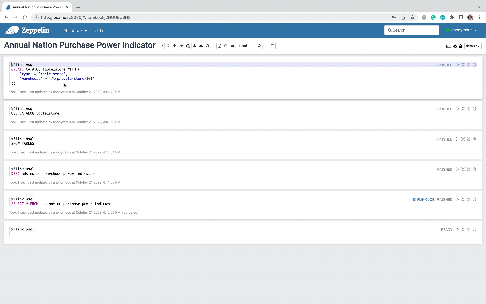
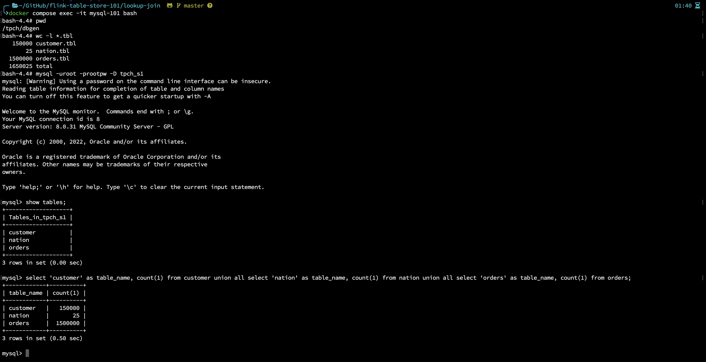
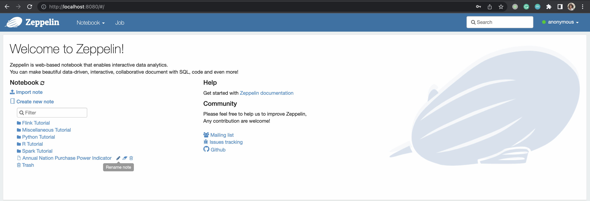
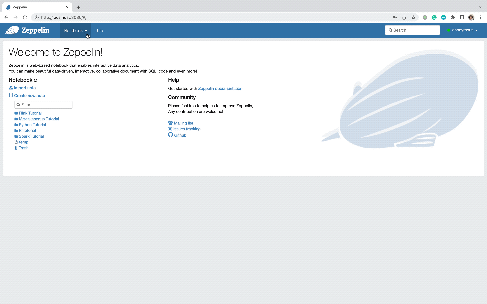
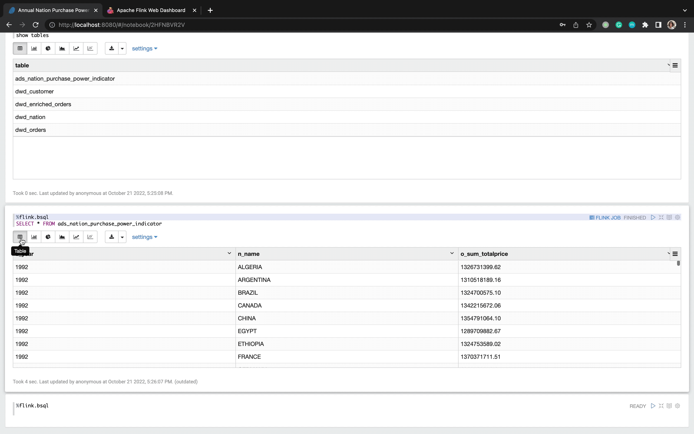
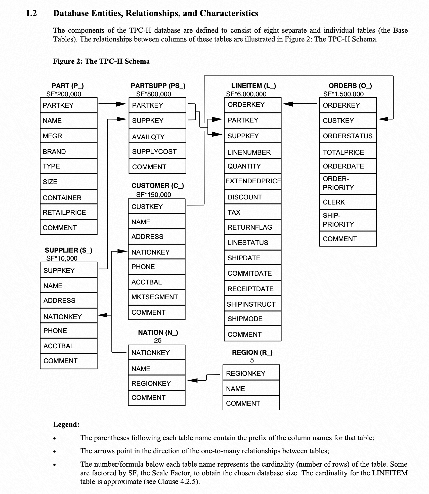

# Lookup Join and Pre-aggregated Insert using Flink Table Store
*Read this in other languages* [简体中文](https://github.com/LadyForest/flink-table-store-101/blob/master/lookup-join/README.zh.md)

## Brief Introduction
This is a handy demo to illustrate how Flink Table Store (*abbr.* **FTS**) supports look-up join and use pre-aggregate as merge engine. The aggregated result is visualized by Apache Zeppelin.


The TPC-H toolkit, MySQL and Zeppelin notebook are running on docker containers, and Flink release and FTS dependencies are downloaded and running on your host machine.

#### About Data Genration  
[TPC-H](https://www.tpc.org/tpch/) as a classic Ad-hoc query benchmark, it reveals not only the performance of SUT (system under test), but also models all sorts of data requirements close to the business senario in the real-word. This demo chooses `orders`, `customer` and `nation` and simplified TPC-H Q5 to demonstrate the capability of FTS.

Schema of `orders` 
<table>
  <thead>
      <tr>
          <th>Field</th>
          <th>Type</th>
          <th>Description</th>
      </tr>
  </thead>
  <tbody>
      <tr>
        <td>o_orderkey</td>
        <td>INT NOT NULL</td>
        <td>main order's key, primary key</td>
      </tr>
      <tr>
        <td>o_custkey</td>
        <td>INT NOT NULL</td>
        <td>customer's key</td>
      </tr>
      <tr>
        <td>o_orderstatus</td>
        <td>CHAR(1)</td>
        <td>order's status, such as <code>O</code>，<code>F</code>，<code>P</code></td>
      </tr>
      <tr>
        <td>o_totalprice</td>
        <td>DECIMAL(15, 2) NOT NULL</td>
        <td>order's price</td>
      </tr>
      <tr>
        <td>o_orderdate</td>
        <td>DECIMAL(15, 2) NOT NULL</td>
        <td>order date</td>
      </tr>
      <tr>
        <td>o_orderpriority</td>
        <td>CHAR(15) NOT NULL</td>
        <td>order's priority with value range <code>1-URGENT</code>, <code>2-HIGH</code>, <code>3-MEDIUM</code>, <code>4-NOT SPECIFIED</code>, <code>5-LOW</code></td>
      </tr>
      <tr>
        <td>o_clerk</td>
        <td>CHAR(15) NOT NULL</td>
        <td>information of clerk</td>
      </tr>
      <tr>
        <td>o_shippriority</td>
        <td>INT NOT NULL</td>
        <td>shipping priority</td>
      </tr>
      <tr>
        <td>o_comment</td>
        <td>VARCHAR(79) NOT NULL</td>
        <td>order's comment</td>
      </tr>
    </tbody>
</table>

Schema of `nation`
<table>
  <thead>
      <tr>
          <th>Field</th>
          <th>Type</th>
          <th>Description</th>
      </tr>
  </thead>
  <tbody>
      <tr>
        <td>n_nationkey</td>
        <td>INT NOT NULL</td>
        <td>nation's key</td>
      </tr>
      <tr>
        <td>n_name</td>
        <td>CHAR(25) NOT NULL</td>
        <td>nation name</td>
      </tr>
      <tr>
        <td>n_regionkey</td>
        <td>INT NOT NULL</td>
        <td>region's key</td>
      </tr>
      <tr>
        <td>n_comment</td>
        <td>VARCHAR(152) NOT NULL</td>
        <td>nation's comment</td>
      </tr>
    </tbody>
</table>


Schema of `customer`
<table>
  <thead>
      <tr>
          <th>Field</th>
          <th>Type</th>
          <th>Description</th>
      </tr>
  </thead>
  <tbody>
      <tr>
        <td>c_custkey</td>
        <td>INT NOT NULL</td>
        <td>customer's key, primary key</td>
      </tr>
      <tr>
        <td>c_name</td>
        <td>VARCHAR(25) NOT NULL</td>
        <td>customer's name</td>
      </tr>
      <tr>
        <td>c_address</td>
        <td>VARCHAR(40) NOT NULL</td>
        <td>customer's address</td>
      </tr>
      <tr>
        <td>c_nationkey</td>
        <td>INT NOT NULL</td>
        <td>customer's nation, foreign key</td>
      </tr>
      <tr>
        <td>c_phone</td>
        <td>CHAR(15) NOT NULL</td>
        <td>customer's phone number</td>
      </tr>
      <tr>
        <td>c_acctbal</td>
        <td>CHAR(15) NOT NULL</td>
        <td>customer's account balance</td>
      </tr>
      <tr>
        <td>c_mktsegment</td>
        <td>DECIMAL(15, 2) NOT NULL</td>
        <td>customer's market segment</td>
      </tr>
      <tr>
        <td>c_comment</td>
        <td>VARCHAR(117) NOT NULL</td>
        <td>customer's comment</td>
      </tr>
    </tbody>
</table>

#### About Business Insights  
  
  - This query reports the annual purchase power of each nation's customer
  - Purchase power is calculated by `sum(o_totalprice)`.

#### Brief Step Summary 
  1. Start MySQL container via docker compose, and the container will generate data with scale factor 1 and load the following three tables under the database `tpch_s1` automatically. It takes about 1-2 minutes to generate the data, and about 1-3 minutes to load the data. During this period, you can download and prepare Flink, Flink CDC and FTS dependencies, and start Flink cluster and SQL CLI.
   
      - `orders.tbl` to `orders`
      - `customer.tbl` to `customer` 
      - `nation.tbl` to `nation`       
  
  2. After the load finishes, start the streaming CDC job to sync the full snapshot to FTS DWD table and downstream pipelines.
  
  3. Start Zeppelin container to visualize the aggregated result.

## Get Started 

### Build Dokcer Image & Start Container
Before start, please make sure your local machine has a least 10G free Docker Disk Image.  
Under directory `flink-table-store-101/lookup-join`, execute
```bash
docker compose build --no-cache && docker-compose up -d --force-recreate
```
This will invoke the Docker to first build a customized MySQL image which is initialized by TPC-H toolkit with scale factor 1. The build phase takes abount to 1-2 minitues (it depends). After the build phase, the MySQL container is initialized with `tpch_s1` as database name，and three tables, and use `LOAD DATA INFILE` to load the data. You can use `docker compose logs -f` track the loading progress. It takes about 2-3 minutes to finish the loading. 

Meanwhile, you can also enter the internal container by `docker exec -it ${container-id} bash`, and the current working directory should be `/tpch/dbgen`, use `wc -l *.tbl` to check the the record num and compare with MySQL tables.



**The loading process completes when you see the following log, which indicates you can start the Flink CDC job now**
```plaintext
[System] [MY-010931] [Server] /usr/sbin/mysqld: ready for connections. Version: '8.0.30'  socket: '/var/run/mysqld/mysqld.sock'  port: 3306  MySQL Community Server - GPL.
```

### Download Flink Release, FTS and Other Dependencies
This demo uses [flink-1.14.5 release](https://flink.apache.org/downloads.html#apache-flink-1145), and the extra dependecies needed are
- Flink MySQL CDC Connector 
- FTS compiled on master branch with Flink 1.14 profile
- Hadoop Bundle Jar

To ease the preparation，the mentioned dependecies are already packed under the directory of `flink-table-store-101/flink/lib` of this repository, you can directly download and put them under `flink-1.14.5/lib` on your local machine. If you prefer do it by yourself, you can also reach to

- [flink-sql-connector-mysql-cdc-2.2.1.jar](https://repo1.maven.org/maven2/com/ververica/flink-sql-connector-mysql-cdc/2.2.1/flink-sql-connector-mysql-cdc-2.2.1.jar)  
- [Hadoop Bundle Jar](https://repo.maven.apache.org/maven2/org/apache/flink/flink-shaded-hadoop-2-uber/2.8.3-10.0/flink-shaded-hadoop-2-uber-2.8.3-10.0.jar) 
- Switch to master branch and use JKD8 and `mvn clean install -Dmaven.test.skip=true -Pflink-1.14` to build the latest FTS.

Now you can list the `lib` directory to check the completeness of denepdnecies.
```
lib
├── flink-csv-1.14.5.jar
├── flink-dist_2.11-1.14.5.jar
├── flink-json-1.14.5.jar
├── flink-shaded-hadoop-2-uber-2.8.3-10.0.jar
├── flink-shaded-zookeeper-3.4.14.jar
├── flink-sql-connector-mysql-cdc-2.2.1.jar
├── flink-table-store-dist-0.3-SNAPSHOT.jar
├── flink-table_2.11-1.14.5.jar
├── log4j-1.2-api-2.17.1.jar
├── log4j-api-2.17.1.jar
├── log4j-core-2.17.1.jar
└── log4j-slf4j-impl-2.17.1.jar
```

### Step3 - Modify flink-conf and Start Cluster
`vim flink-1.14.5/conf/flink-conf.yaml` with following conf
```yaml
jobmanager.memory.process.size: 4096m
taskmanager.memory.process.size: 4096m
taskmanager.numberOfTaskSlots: 8
parallelism.default: 1
execution.checkpointing.interval: 1min
state.backend: rocksdb
state.backend.incremental: true
jobmanager.execution.failover-strategy: region
execution.checkpointing.checkpoints-after-tasks-finish.enabled: true
```

If you want to observe the verbose info of compaction and commit for FTS, you can pick one or all of the following properties to `log4j.properties` under the `flink-1.14.5/conf` as needed
```
# Log FTS
logger.commit.name = org.apache.flink.table.store.file.operation.FileStoreCommitImpl
logger.commit.level = DEBUG

logger.compaction.name = org.apache.flink.table.store.file.mergetree.compact
logger.compaction.level = DEBUG

logger.enumerator.name = org.apache.flink.table.store.connector.source.ContinuousFileSplitEnumerator
logger.enumerator.level = DEBUG
```
Then start the cluster by `./bin/start-cluster.sh` under directory `flink-1.14.5`

### Step4 - Start Flink SQL CLI with Initialized Schema SQL
Under `flink-1.14.5` touch a file `schema.sql` and paste the following SQL to initialize.
```sql
-- switch to streaming mode
SET 'execution.runtime-mode' = 'streaming';

-- set result mode to tableau
SET 'sql-client.execution.result-mode' = 'tableau';

-- create FTS catalog and set it to current catalog
CREATE CATALOG `table_store` WITH (
    'type' = 'table-store',
    'warehouse' = '/tmp/table-store-101'
);

USE CATALOG `table_store`;

-- ODS table schema

-- note that under the FTS catalog, when you create some other mirroring tables with connectors, you need to explictly state them as temporary
CREATE TEMPORARY TABLE `ods_orders` (
  `o_orderkey`       INTEGER NOT NULL,
  `o_custkey`        INTEGER NOT NULL,
  `o_orderstatus`    CHAR(1) NOT NULL,
  `o_totalprice`     DECIMAL(15,2) NOT NULL,
  `o_orderdate`      DATE NOT NULL,
  `o_orderpriority`  CHAR(15) NOT NULL,  
  `o_clerk`          CHAR(15) NOT NULL, 
  `o_shippriority`   INTEGER NOT NULL,
  `o_comment`        VARCHAR(79) NOT NULL,
  PRIMARY KEY (`o_orderkey`) NOT ENFORCED
) WITH (
  'connector' = 'mysql-cdc',
  'hostname' = '127.0.0.1',
  'port' = '3307',
  'username' = 'flink',
  'password' = 'flink',
  'database-name' = 'tpch_s1',
  'table-name' = 'orders'
);

CREATE TEMPORARY TABLE `ods_customer` (
  `c_custkey`     INTEGER NOT NULL,
  `c_name`        VARCHAR(25) NOT NULL,
  `c_address`     VARCHAR(40) NOT NULL,
  `c_nationkey`   INTEGER NOT NULL,
  `c_phone`       CHAR(15) NOT NULL,
  `c_acctbal`     DECIMAL(15,2) NOT NULL,
  `c_mktsegment`  CHAR(10) NOT NULL,
  `c_comment`     VARCHAR(117) NOT NULL,
  PRIMARY KEY (`c_custkey`) NOT ENFORCED
) WITH (
  'connector' = 'mysql-cdc',
  'hostname' = '127.0.0.1',
  'port' = '3307',
  'username' = 'flink',
  'password' = 'flink',
  'database-name' = 'tpch_s1',
  'table-name' = 'customer'
);

CREATE TEMPORARY TABLE `ods_nation` (
  `n_nationkey`  INTEGER NOT NULL,
  `n_name`       CHAR(25) NOT NULL,
  `n_regionkey`  INTEGER NOT NULL,
  `n_comment`    VARCHAR(152),
  PRIMARY KEY (`n_nationkey`) NOT ENFORCED
) WITH (
  'connector' = 'mysql-cdc',
  'hostname' = '127.0.0.1',
  'port' = '3307',
  'username' = 'flink',
  'password' = 'flink',
  'database-name' = 'tpch_s1',
  'table-name' = 'nation'
);

-- DWD table schema
CREATE TABLE `dwd_orders` (
  `o_year`           BIGINT NOT NULL, -- computed against o_orderdate
  `ptime`            AS PROCTIME(),
  PRIMARY KEY (`o_year`, `o_orderkey`) NOT ENFORCED
) PARTITIONED BY (`o_year`)
WITH (
  'changelog-producer' = 'input'
) LIKE `ods_orders` (EXCLUDING CONSTRAINTS EXCLUDING OPTIONS);

CREATE TABLE `dwd_customer` LIKE `ods_customer` (EXCLUDING OPTIONS);

CREATE TABLE `dwd_nation` LIKE `ods_nation` (EXCLUDING OPTIONS);

-- disable sink materialize and use sequence.field to specifiy the order when merging happens
SET 'table.exec.sink.upsert-materialize' = 'none';

-- enriched table
CREATE TABLE dwd_enriched_orders (
  `o_year`           BIGINT NOT NULL,
  `o_orderkey`       INTEGER NOT NULL,
  `o_custkey`        INTEGER NOT NULL,
  `o_orderstatus`    CHAR(1) NOT NULL,
  `o_totalprice`     DECIMAL(15,2) NOT NULL,
  `o_orderdate`      DATE NOT NULL,
  `o_orderpriority`  CHAR(15) NOT NULL,  
  `o_clerk`          CHAR(15) NOT NULL, 
  `o_shippriority`   INTEGER NOT NULL,
  `o_comment`        VARCHAR(79) NOT NULL,
  `c_name`           VARCHAR(25) NOT NULL,
  `c_address`        VARCHAR(40) NOT NULL,
  `c_nationkey`      INTEGER NOT NULL,
  `c_phone`          CHAR(15) NOT NULL,
  `c_acctbal`        DECIMAL(15,2) NOT NULL,
  `c_mktsegment`     CHAR(10) NOT NULL,
  `c_comment`        VARCHAR(117) NOT NULL,
  `n_name`           CHAR(25) NOT NULL,
  `n_regionkey`      INTEGER NOT NULL,
  `n_comment`        VARCHAR(152) NOT NULL,
  PRIMARY KEY (`o_year`, `o_orderkey`) NOT ENFORCED
) WITH (
  'changelog-producer' = 'input',
  'sequence.field' = 'o_orderdate' -- use o_orderdate to generate sequence id, in order to avoid disorder
);

-- ADS table schema
CREATE TABLE ads_nation_purchase_power_indicator (
  `o_year`              BIGINT,
  `n_name`              CHAR(25) NOT NULL,
  `o_sum_totalprice`    DECIMAL(15,2) NOT NULL,
  PRIMARY KEY (`o_year`, `n_name`) NOT ENFORCED
) WITH (
  'changelog-producer' = 'input',
  'merge-engine' = 'aggregation', -- o_totalprice will be aggregated as o_sum_totalprice
  'fields.o_sum_totalprice.aggregate-function' = 'sum'
);
```
Then start SQL CLI
```bash
./bin/sql-client.sh -i schema.sql
```

### Step5 - Submit Flink ETL Pipeline

- Job1 - `ods_orders` to `dwd_orders`

  ```sql
  SET 'pipeline.name' = 'dwd_orders';
  ```

  ```sql
  INSERT INTO `dwd_orders`
  SELECT
    `o_orderkey`,
    `o_custkey`,    
    `o_orderstatus`, 
    `o_totalprice`, 
    `o_orderdate`, 
    `o_orderpriority`, 
    `o_clerk`,        
    `o_shippriority`, 
    `o_comment`,
    YEAR(`o_orderdate`) AS `o_year`
  FROM `ods_orders`;
  ```

- Job2 - `ods_nation` to `dwd_nation`

  ```sql
  SET 'pipeline.name' = 'dwd_nation';
  ```

  ```sql
  INSERT INTO `dwd_nation`
  SELECT * FROM `ods_nation`;
  ```

- Job3 - `ods_customer` to `dwd_customer`

  ```sql
  SET 'pipeline.name' = 'dwd_customer';
  ```

  ```sql
  INSERT INTO `dwd_customer`
  SELECT * FROM `ods_customer`;
  ```

- Job4 - perform look up join and write to `dwd_enriched_orders`

  ```sql
  SET 'pipeline.name' = 'dwd_enriched_orders';
  ```

  ```sql
  INSERT INTO dwd_enriched_orders
  SELECT 
    YEAR(`d`.`o_orderdate`) AS `o_year`, 
    `d`.`o_orderkey`,
    `d`.`o_custkey`,
    `d`.`o_orderstatus`,
    `d`.`o_totalprice`,
    `d`.`o_orderdate`,
    `d`.`o_orderpriority`,
    `d`.`o_clerk`,
    `d`.`o_shippriority`,
    `d`.`o_comment`,
    `d`.`c_name`,
    `d`.`c_address`,
    `d`.`c_nationkey`,
    `d`.`c_phone`,
    `d`.`c_acctbal`,
    `d`.`c_mktsegment`,
    `d`.`c_comment`,
    COALESCE(`n`.`n_name`, CAST('UNKNOWN' AS CHAR(25))) AS `n_name`,
    COALESCE(`n`.`n_regionkey`, -1) AS `n_regionkey`,
    COALESCE(`n`.`n_comment`, 'missing comments') AS `n_comment`
  FROM (
    SELECT
    `o`.*, 
    COALESCE(`c`.`c_name`, ' Customer#anoymous') AS `c_name`, 
    COALESCE(`c`.`c_address`, 'anoymous') AS `c_address`,
    COALESCE(`c`.`c_nationkey`, -1) AS `c_nationkey`,
    COALESCE(`c`.`c_phone`, '00-000-000-0000') AS `c_phone`,
    COALESCE(`c`.`c_acctbal`, 0) AS `c_acctbal`,
    COALESCE(`c`.`c_mktsegment`, CAST('UNKNOWN' AS CHAR(10))) AS `c_mktsegment`,
    COALESCE(`c`.`c_comment`, 'missing comments') AS `c_comment`
    FROM `dwd_orders` AS `o`
    LEFT JOIN `dwd_customer` FOR SYSTEM_TIME AS OF `o`.`ptime` AS `c`
    ON `o`.`o_custkey` = `c`.`c_custkey`
  ) `d` LEFT JOIN `dwd_nation` FOR SYSTEM_TIME AS OF `d`.`ptime` AS `n`
  ON `d`.`c_nationkey` = `n`.`n_nationkey`;
  ```

- Job5 - Insert to table `ads_nation_purchase_power_indicator` using pre-aggregation
  ```sql
  SET 'pipeline.name' = 'ads_nation_purchase_power_indicator';
  INSERT INTO `ads_nation_purchase_power_indicator`
  SELECT 
    `o_year`,
    `n_name`,
    `o_totalprice` AS `o_sum_totalprice`
  FROM `dwd_enriched_orders`;
  ```

### Step6 - Query & Visualize Indicators
We are now to use Apache Zeppelin Notebook to query and visualize our aggregated result.

First of all, `cd ${your-machine}/flink-1.14.5` 
since we need to mount the flink dist and table store directories to Zeppelin container
```bash
docker run -p 8080:8080 \
  --rm \
  -d \
  -v $(pwd):/opt/flink \
  -v /tmp/table-store-101:/tmp/table-store-101 \
  --name zeppelin apache/zeppelin:0.10.1
```

If everything goes well, you will see the homepage of Zeppelin Notebook by browsing `localhost:8080`.


Then we need to set up the existed Flink cluster (on your host machine) as the Zeppelin Notebook's Flink Interpreter (as remote mode).
Click the `Interpreter` button and find `flink`, click `edit` button and modify the following configurations
```
FLINK_HOME: /opt/flink
flink.execution.mode: remote
flink.execution.remote.host: host.docker.internal 
flink.execution.remote.port: 8081
zeppelin.flink.uiWebUrl: host.docker.internal:8081
```
Last but not least, click the `Save` button, Zeppelin will automatically apply and restart.


Congratulations! We're almost done.

Then we can create a new Notebook called `Annual Nation Purchase Power Indicator` and choose `flink` as Interpreter type.

Since we've mounted `/tmp/table-store-101`, we can directly register and use `table_store` catalog.

```sql
%flink.bsql
CREATE CATALOG table_store WITH (
    'type' = 'table-store',
    'warehouse' = '/tmp/table-store-101'
);
```

```sql
%flink.bsql
USE CATALOG table_store
```
We can `SHOW TABLES` and `DESCRIBE ${table}` to check the table info.

```sql
%flink.bsql
DESC ads_nation_purchase_power_indicator
```



Then we can query and visualize the table `ads_nation_purchase_power_indicator`. Choose `Bar Chart` as result type, `o_year` as keys, `n_name` as groups and `o_sum_totalprice` as values.
```sql
%flink.bsql
SELECT * FROM ads_nation_purchase_power_indicator
```



### Step8 - Finish Demo & Cleanup
1. Execute `exit;`  to exit Flink SQL CLI
2. Under `flink-1.14.5` directory, execute ./bin/stop-cluster.sh to stop Flink cluster
3. Excute `docker stop zeppelin` to stop and remove Zeppelin container
4. Under `table-store-101/lookup-join` directory, execute
    ```bash
    docker compose down && docker rmi lookup-join_mysql-101 && docker volume prune && docker builder prune
    ```
    Note: add `-f` for `prune` at your own risk.
5. Execute `rm -rf /tmp/table-store-101`

## Appendix
TPC-H's table relation
  