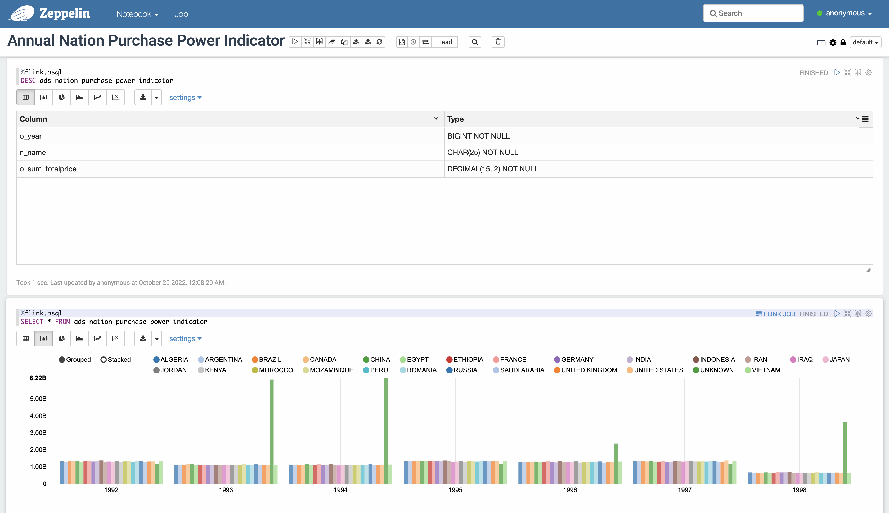
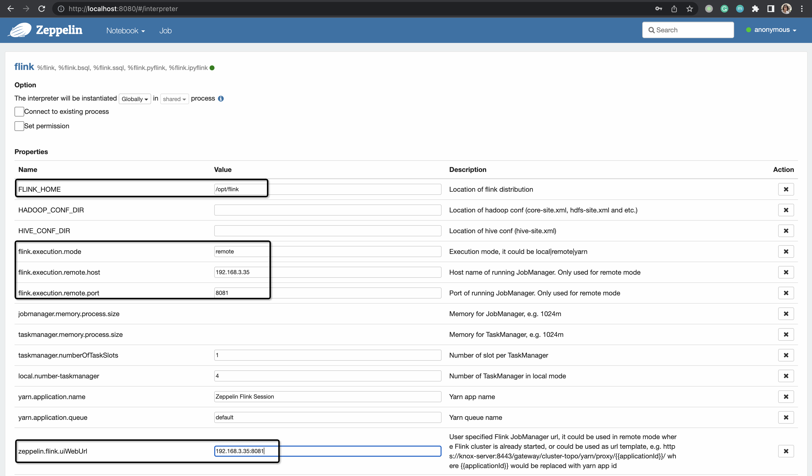
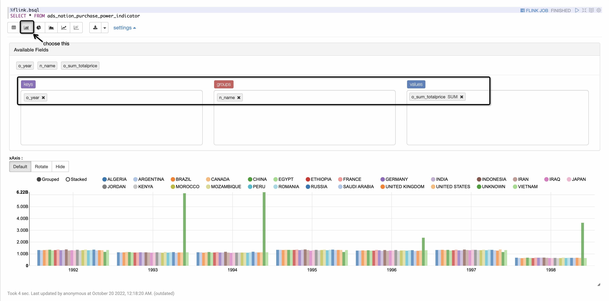

# 基于 Apache Flink Table Store 的维表连接
*其它语言版本* [English](https://github.com/LadyForest/flink-table-store-101/tree/master/lookup-join/README.md)

## 用例简介
Flink Table Store（以下简称 **FTS**）表作为 Lookup 表用于维表关联、预聚合计算聚合指标、结果使用 Zeppelin 可视化的用例。


#### 关于数据生成  
[TPC-H](https://www.tpc.org/tpch/) 作为一个经典的 Ad-hoc query 性能测试 benchmark，其包含的数据模型与真实的商业场景十分类似。本用例选取其中三张表 `orders`， `customer` 和 `nation`，适当简化了 TPC-H Q5，展示 FTS 用于维表 join 的场景。

Schema of `orders` 
<table>
  <thead>
      <tr>
          <th>字段</th>
          <th>类型</th>
          <th>描述</th>
      </tr>
  </thead>
  <tbody>
      <tr>
        <td>o_orderkey</td>
        <td>INT NOT NULL</td>
        <td>主订单 key，即主订单 id，主键</td>
      </tr>
      <tr>
        <td>o_custkey</td>
        <td>INT NOT NULL</td>
        <td>客户 key，即买家 id</td>
      </tr>
      <tr>
        <td>o_orderstatus</td>
        <td>CHAR(1)</td>
        <td>订单状态，取值范围 <code>O</code>，<code>F</code>，<code>P</code></td>
      </tr>
      <tr>
        <td>o_totalprice</td>
        <td>DECIMAL(15, 2) NOT NULL</td>
        <td>订单价格</td>
      </tr>
      <tr>
        <td>o_orderdate</td>
        <td>DECIMAL(15, 2) NOT NULL</td>
        <td>订单日期</td>
      </tr>
      <tr>
        <td>o_orderpriority</td>
        <td>CHAR(15) NOT NULL</td>
        <td>订单优先级，取值范围在 <code>1-URGENT</code>，<code>2-HIGH</code>，<code>3-MEDIUM</code>，<code>4-NOT SPECIFIED</code>，<code>5-LOW</code></td>
      </tr>
      <tr>
        <td>o_clerk</td>
        <td>CHAR(15) NOT NULL</td>
        <td>收银员信息</td>
      </tr>
      <tr>
        <td>o_shippriority</td>
        <td>INT NOT NULL</td>
        <td>发货优先级</td>
      </tr>
      <tr>
        <td>o_comment</td>
        <td>VARCHAR(79) NOT NULL</td>
        <td>订单备注</td>
      </tr>
    </tbody>
</table>

Schema of `nation`
<table>
  <thead>
      <tr>
          <th>字段</th>
          <th>类型</th>
          <th>描述</th>
      </tr>
  </thead>
  <tbody>
      <tr>
        <td>n_nationkey</td>
        <td>INT NOT NULL</td>
        <td>国家 id，主键</td>
      </tr>
      <tr>
        <td>n_name</td>
        <td>CHAR(25) NOT NULL</td>
        <td>客户 key，即买家 id</td>
      </tr>
      <tr>
        <td>n_regionkey</td>
        <td>INT NOT NULL</td>
        <td>国家所属区域 key</td>
      </tr>
      <tr>
        <td>n_comment</td>
        <td>VARCHAR(152) NOT NULL</td>
        <td>备注</td>
      </tr>
    </tbody>
</table>


Schema of `customer`
<table>
  <thead>
      <tr>
          <th>字段</th>
          <th>类型</th>
          <th>描述</th>
      </tr>
  </thead>
  <tbody>
      <tr>
        <td>c_custkey</td>
        <td>INT NOT NULL</td>
        <td>客户 key，即买家 id，主键</td>
      </tr>
      <tr>
        <td>c_name</td>
        <td>VARCHAR(25) NOT NULL</td>
        <td>买家姓名</td>
      </tr>
      <tr>
        <td>c_address</td>
        <td>VARCHAR(40) NOT NULL</td>
        <td>买家联系地址</td>
      </tr>
      <tr>
        <td>c_nationkey</td>
        <td>INT NOT NULL</td>
        <td>买家所属国家，外键</td>
      </tr>
      <tr>
        <td>c_phone</td>
        <td>CHAR(15) NOT NULL</td>
        <td>买家手机号</td>
      </tr>
      <tr>
        <td>c_acctbal</td>
        <td>CHAR(15) NOT NULL</td>
        <td>买家账户余额</td>
      </tr>
      <tr>
        <td>c_mktsegment</td>
        <td>DECIMAL(15, 2) NOT NULL</td>
        <td>买家对应的市场区域</td>
      </tr>
      <tr>
        <td>c_comment</td>
        <td>VARCHAR(117) NOT NULL</td>
        <td>买家备注</td>
      </tr>
    </tbody>
</table>

#### 商业洞察需求  
  
  - 通过统计订单表 `orders`，计算各个国家的年度购买力
  - 购买力定义为该国家的买家年度购买总金额 `sum(o_totalprice)`

#### 步骤简介 
  1. 通过 docker-compose 启动服务，以 scale factor 1 初始化 MySQL container, 生成如下三张表并自动导入到名为 `tpch_s1` 数据库
      - `orders` 订单事实表
      - `customer` 客户维表
      - `nation` 国家维表
  2. 在本地下载 Flink、Flink CDC 及 FTS 相关依赖，修改配置，启动 SQL CLI
  3. 将 MySQL 订单明细表通过 Flink CDC 同步到 FTS 对应表，并启动实时写入任务

## 快速开始 

### 第一步：构建镜像，启动容器服务
在开始之前，请确保本机 Docker Disk Image 至少有 10G 空间  
在 `flink-table-store-101/lookup-join` 目录下运行
```bash
docker compose build --no-cache && docker-compose up -d --force-recreate
```
构建镜像阶段将会使用 TPC-H 自带工具产生约 1G 数据 (scale factor = 1)，整个构建过程大约需要 2 分钟左右，镜像构建完成后容器启动，将会自动创建名为 `tpch_s1` 的数据库及上述三张表，并通过 `LOAD DATA INFILE` 自动导入。可以通过 `docker compose logs -f` 来查看导入进度，此过程耗时约 3-4 分钟，

可以通过 `docker exec -it ${container-id} bash` 进入容器内部，当前工作目录即为 `/tpch/dbgen`, 用 `wc -l *.tbl` 查看产生的数据行数；与导入 MySQL 的数据进行比对


**当看到如下日志时，说明导入已经完成**
```plaintext
[System] [MY-010931] [Server] /usr/sbin/mysqld: ready for connections. Version: '8.0.30'  socket: '/var/run/mysqld/mysqld.sock'  port: 3306  MySQL Community Server - GPL.
```

### 第二步：下载 Flink、FTS 及其他所需依赖
Demo 运行使用 Flink 1.14.5 版本（ [flink-1.14.5 下载链接](https://flink.apache.org/downloads.html#apache-flink-1145) ），需要的其它依赖如下
- Flink MySQL CDC Connector 
- 在 master 分支基于 Flink 1.14 编译的 FTS
- Hadoop Bundle Jar

为方便操作，您可以直接在本项目的 `flink-table-store-101/flink/lib` 目录下载所有依赖，并放置于 `flink-1.14.5/lib` 目录下，也可以自行下载及编译

- [flink-sql-connector-mysql-cdc-2.2.1.jar](https://repo1.maven.org/maven2/com/ververica/flink-sql-connector-mysql-cdc/2.2.1/flink-sql-connector-mysql-cdc-2.2.1.jar)  
- [Hadoop Bundle Jar](https://repo.maven.apache.org/maven2/org/apache/flink/flink-shaded-hadoop-2-uber/2.8.3-10.0/flink-shaded-hadoop-2-uber-2.8.3-10.0.jar) 
- 切换到 master 分支，使用 JKD8 及 `mvn clean install -Dmaven.test.skip=true -Pflink-1.14` [编译](https://nightlies.apache.org/flink/flink-table-store-docs-master/docs/engines/build/) 最新 release-0.3 版本

上述步骤完成后，lib 目录结构如图所示  
```
lib
├── flink-csv-1.14.5.jar
├── flink-dist_2.11-1.14.5.jar
├── flink-json-1.14.5.jar
├── flink-shaded-hadoop-2-uber-2.8.3-10.0.jar
├── flink-shaded-zookeeper-3.4.14.jar
├── flink-sql-connector-mysql-cdc-2.2.1.jar
├── flink-table-store-dist-0.3-SNAPSHOT.jar
├── flink-table_2.11-1.14.5.jar
├── log4j-1.2-api-2.17.1.jar
├── log4j-api-2.17.1.jar
├── log4j-core-2.17.1.jar
└── log4j-slf4j-impl-2.17.1.jar
```

### 第三步：修改 flink-conf 配置文件并启动集群
`vim flink-1.14.5/conf/flink-conf.yaml` 文件，按如下配置修改
```yaml
jobmanager.memory.process.size: 4096m
taskmanager.memory.process.size: 4096m
taskmanager.numberOfTaskSlots: 8
parallelism.default: 1
execution.checkpointing.interval: 1min
state.backend: rocksdb
state.backend.incremental: true
jobmanager.execution.failover-strategy: region
execution.checkpointing.checkpoints-after-tasks-finish.enabled: true
```

若想观察 FTS 的异步合并、提交及流式消费等信息，可以在 `flink-1.14.5/conf` 目录下修改 log4j.properties 文件，增加如下配置
```
# Log FTS
logger.commit.name = org.apache.flink.table.store.file.operation.FileStoreCommitImpl
logger.commit.level = DEBUG

logger.compaction.name = org.apache.flink.table.store.file.mergetree.compact
logger.compaction.level = DEBUG

logger.enumerator.name = org.apache.flink.table.store.connector.source.ContinuousFileSplitEnumerator
logger.enumerator.level = DEBUG
```
然后在 `flink-1.14.5` 目录下执行 `./bin/start-cluster.sh`

### 第四步：初始化表 schema 并启动 Flink SQL CLI
在 `flink-1.14.5` 目录下新建 `schema.sql` 文件，配置用例所需表的 schema 和 FTS Catalog 作为 init sql
```sql
-- 设置使用流模式
SET 'execution.runtime-mode' = 'streaming';

-- 设置结果展示为 tableau 模式
SET 'sql-client.execution.result-mode' = 'tableau';

-- 创建并使用 FTS Catalog
CREATE CATALOG `table_store` WITH (
    'type' = 'table-store',
    'warehouse' = '/tmp/table-store-101'
);

USE CATALOG `table_store`;

-- ODS table schema

-- 注意在 FTS Catalog 下，创建使用其它连接器的表时，需要将表声明为临时表
CREATE TEMPORARY TABLE `ods_orders` (
  `o_orderkey`       INTEGER NOT NULL,
  `o_custkey`        INTEGER NOT NULL,
  `o_orderstatus`    CHAR(1) NOT NULL,
  `o_totalprice`     DECIMAL(15,2) NOT NULL,
  `o_orderdate`      DATE NOT NULL,
  `o_orderpriority`  CHAR(15) NOT NULL,  
  `o_clerk`          CHAR(15) NOT NULL, 
  `o_shippriority`   INTEGER NOT NULL,
  `o_comment`        VARCHAR(79) NOT NULL,
  PRIMARY KEY (`o_orderkey`) NOT ENFORCED
) WITH (
  'connector' = 'mysql-cdc',
  'hostname' = '127.0.0.1',
  'port' = '3307',
  'username' = 'flink',
  'password' = 'flink',
  'database-name' = 'tpch_s1',
  'table-name' = 'orders'
);

CREATE TEMPORARY TABLE `ods_customer` (
  `c_custkey`     INTEGER NOT NULL,
  `c_name`        VARCHAR(25) NOT NULL,
  `c_address`     VARCHAR(40) NOT NULL,
  `c_nationkey`   INTEGER NOT NULL,
  `c_phone`       CHAR(15) NOT NULL,
  `c_acctbal`     DECIMAL(15,2) NOT NULL,
  `c_mktsegment`  CHAR(10) NOT NULL,
  `c_comment`     VARCHAR(117) NOT NULL,
  PRIMARY KEY (`c_custkey`) NOT ENFORCED
) WITH (
  'connector' = 'mysql-cdc',
  'hostname' = '127.0.0.1',
  'port' = '3307',
  'username' = 'flink',
  'password' = 'flink',
  'database-name' = 'tpch_s1',
  'table-name' = 'customer'
);

CREATE TEMPORARY TABLE `ods_nation` (
  `n_nationkey`  INTEGER NOT NULL,
  `n_name`       CHAR(25) NOT NULL,
  `n_regionkey`  INTEGER NOT NULL,
  `n_comment`    VARCHAR(152),
  PRIMARY KEY (`n_nationkey`) NOT ENFORCED
) WITH (
  'connector' = 'mysql-cdc',
  'hostname' = '127.0.0.1',
  'port' = '3307',
  'username' = 'flink',
  'password' = 'flink',
  'database-name' = 'tpch_s1',
  'table-name' = 'nation'
);

-- DWD table schema
CREATE TABLE `dwd_orders` (
  `o_year`           BIGINT NOT NULL, -- 以 o_orderdate 生成分区字段
  `ptime`            AS PROCTIME(),
  PRIMARY KEY (`o_year`, `o_orderkey`) NOT ENFORCED
) PARTITIONED BY (`o_year`)
WITH (
  'changelog-producer' = 'input'
) LIKE `ods_orders` (EXCLUDING CONSTRAINTS EXCLUDING OPTIONS);

CREATE TABLE `dwd_customer` LIKE `ods_customer` (EXCLUDING OPTIONS);

CREATE TABLE `dwd_nation` LIKE `ods_nation` (EXCLUDING OPTIONS);

-- 关闭 sink materialize，使用 sequence.field 字段指定按主键合并时的顺序，解决乱序问题
SET 'table.exec.sink.upsert-materialize' = 'none';

-- 明细大宽表
CREATE TABLE dwd_enriched_orders (
  `o_year`           BIGINT NOT NULL,
  `o_orderkey`       INTEGER NOT NULL,
  `o_custkey`        INTEGER NOT NULL,
  `o_orderstatus`    CHAR(1) NOT NULL,
  `o_totalprice`     DECIMAL(15,2) NOT NULL,
  `o_orderdate`      DATE NOT NULL,
  `o_orderpriority`  CHAR(15) NOT NULL,  
  `o_clerk`          CHAR(15) NOT NULL, 
  `o_shippriority`   INTEGER NOT NULL,
  `o_comment`        VARCHAR(79) NOT NULL,
  `c_name`           VARCHAR(25) NOT NULL,
  `c_address`        VARCHAR(40) NOT NULL,
  `c_nationkey`      INTEGER NOT NULL,
  `c_phone`          CHAR(15) NOT NULL,
  `c_acctbal`        DECIMAL(15,2) NOT NULL,
  `c_mktsegment`     CHAR(10) NOT NULL,
  `c_comment`        VARCHAR(117) NOT NULL,
  `n_name`           CHAR(25) NOT NULL,
  `n_regionkey`      INTEGER NOT NULL,
  `n_comment`        VARCHAR(152) NOT NULL,
  PRIMARY KEY (`o_year`, `o_orderkey`) NOT ENFORCED
) WITH (
  'changelog-producer' = 'input',
  'sequence.field' = 'o_orderdate' -- 使用 o_orderdate 生成 sequence id，相同主键合并时选择 sequence id 更大的记录
);

-- ADS table schema
CREATE TABLE ads_nation_purchase_power_indicator (
  `o_year`              BIGINT,
  `n_name`              CHAR(25) NOT NULL,
  `o_sum_totalprice`    DECIMAL(15,2) NOT NULL,
  PRIMARY KEY (`o_year`, `n_name`) NOT ENFORCED
) WITH (
  'changelog-producer' = 'input',
  'merge-engine' = 'aggregation', -- 使用 aggregation 聚合计算 sum
  'fields.o_sum_totalprice.aggregate-function' = 'sum'
);
```
然后运行 SQL CLI
```bash
./bin/sql-client.sh -i schema.sql
```

### 第五步：提交作业

- 任务1：通过 Flink MySQL CDC 同步 `ods_orders`

  ```sql
  SET 'pipeline.name' = 'dwd_orders';
  ```

  ```sql
  INSERT INTO `dwd_orders`
  SELECT
    `o_orderkey`,
    `o_custkey`,    
    `o_orderstatus`, 
    `o_totalprice`, 
    `o_orderdate`, 
    `o_orderpriority`, 
    `o_clerk`,        
    `o_shippriority`, 
    `o_comment`,
    YEAR(`o_orderdate`) AS `o_year`
  FROM `ods_orders`;
  ```

- 任务2：通过 Flink MySQL CDC 同步 `ods_nation`

  ```sql
  SET 'pipeline.name' = 'dwd_nation';
  ```

  ```sql
  INSERT INTO `dwd_nation`
  SELECT * FROM `ods_nation`;
  ```

- 任务3：通过 Flink MySQL CDC 同步 `ods_customer`

  ```sql
  SET 'pipeline.name' = 'dwd_customer';
  ```

  ```sql
  INSERT INTO `dwd_customer`
  SELECT * FROM `ods_customer`;
  ```

- 任务4：进行维表关联，生成大宽表 `dwd_enriched_orders`

  ```sql
  SET 'pipeline.name' = 'dwd_enriched_orders';
  ```

  ```sql
  INSERT INTO dwd_enriched_orders
  SELECT 
    YEAR(`d`.`o_orderdate`) AS `o_year`, 
    `d`.`o_orderkey`,
    `d`.`o_custkey`,
    `d`.`o_orderstatus`,
    `d`.`o_totalprice`,
    `d`.`o_orderdate`,
    `d`.`o_orderpriority`,
    `d`.`o_clerk`,
    `d`.`o_shippriority`,
    `d`.`o_comment`,
    `d`.`c_name`,
    `d`.`c_address`,
    `d`.`c_nationkey`,
    `d`.`c_phone`,
    `d`.`c_acctbal`,
    `d`.`c_mktsegment`,
    `d`.`c_comment`,
    COALESCE(`n`.`n_name`, CAST('UNKNOWN' AS CHAR(25))) AS `n_name`,
    COALESCE(`n`.`n_regionkey`, -1) AS `n_regionkey`,
    COALESCE(`n`.`n_comment`, 'missing comments') AS `n_comment`
  FROM (
    SELECT
    `o`.*, 
    COALESCE(`c`.`c_name`, ' Customer#anoymous') AS `c_name`, 
    COALESCE(`c`.`c_address`, 'anoymous') AS `c_address`,
    COALESCE(`c`.`c_nationkey`, -1) AS `c_nationkey`,
    COALESCE(`c`.`c_phone`, '00-000-000-0000') AS `c_phone`,
    COALESCE(`c`.`c_acctbal`, 0) AS `c_acctbal`,
    COALESCE(`c`.`c_mktsegment`, CAST('UNKNOWN' AS CHAR(10))) AS `c_mktsegment`,
    COALESCE(`c`.`c_comment`, 'missing comments') AS `c_comment`
    FROM `dwd_orders` AS `o`
    LEFT JOIN `dwd_customer` FOR SYSTEM_TIME AS OF `o`.`ptime` AS `c`
    ON `o`.`o_custkey` = `c`.`c_custkey`
  ) `d` LEFT JOIN `dwd_nation` FOR SYSTEM_TIME AS OF `d`.`ptime` AS `n`
  ON `d`.`c_nationkey` = `n`.`n_nationkey`;
  ```

- 任务5：以聚合模式写入结果表 `ads_nation_purchase_power_indicator`
  ```sql
  -- 设置作业名
  SET 'pipeline.name' = 'ads_nation_purchase_power_indicator';
  INSERT INTO `ads_nation_purchase_power_indicator`
  SELECT 
    `o_year`,
    `n_name`,
    `o_totalprice` AS `o_sum_totalprice`
  FROM `dwd_enriched_orders`;
  ```

### 第六步：查询预聚合表并可视化结果
这一步我们将使用 Zeppelin Notebook 查询聚合表并可视化结果

首先，切换到本地 flink 所在目录，启动 zeppelin 容器
```bash
docker run -p 8080:8080 \
  --rm \
  -d \
  -v $(pwd):/opt/flink \
  -v /tmp/table-store-101:/tmp/table-store-101 \
  --name zeppelin apache/zeppelin:0.10.1
```

然后打开 `localhost:8080` 就可以看到 Zeppelin 界面


点击右上角 anonymous 选择 Interpreter 来配置 Flink 解释器

在 flink 一栏里，修改如下配置并点击保存，Zeppelin 会自动更新解释器配置

注：在宿主机执行 `ifconfig | grep 'inet 192'| awk '{ print $2}'` 得到的 ip 替换掉 ${host-ip}
```
FLINK_HOME: /opt/flink
flink.execution.mode: remote
flink.execution.remote.host: ${host-ip} 
flink.execution.remote.port: 8081
zeppelin.flink.uiWebUrl: ${host-ip}:8081
```



然后创建一个名为 `Annual Nation Purchase Power Indicator` 的 Notebook，解释器类型选 flink，在 Notebook 里注册并使用 `table_store` catalog

```sql
%flink.bsql
CREATE CATALOG table_store WITH (
    'type' = 'table-store',
    'warehouse' = '/tmp/table-store-101'
);
```

```sql
%flink.bsql
USE CATALOG table_store
```
DESCRIBE 表信息
```sql
%flink.bsql
DESC ads_nation_purchase_power_indicator
```


查询并可视化结果，结果展示类型选择为柱状图，keys 选择 `o_year`，groups 选择 `n_name`，values 选择 `o_sum_totalprice`
```sql
%flink.bsql
SELECT * FROM ads_nation_purchase_power_indicator
```



### 第八步：结束 Demo & 释放资源
1. 执行 `exit;` 退出 Flink SQL CLI
2. 在 `flink-1.14.5` 下执行 `./bin/stop-cluster.sh` 停止 Flink 集群
3. 执行 `docker stop zeppelin && docker rm zeppelin` 停止并删除 Zeppelin 容器
4. 在 `table-store-101/lookup-join` 目录下执行 
    ```bash
    docker compose down && docker rmi lookup-join_mysql-101 && docker volume prune && docker builder prune
    ```
    注意：请自行判断是否要增加 `-f` 来强制执行 `prune`
5. 执行 `rm -rf /tmp/table-store-101`

## 附录
TPC-H 的 8 张表如下图所示
  