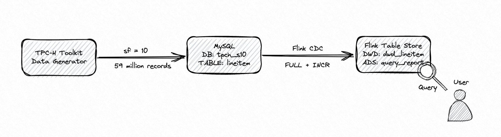
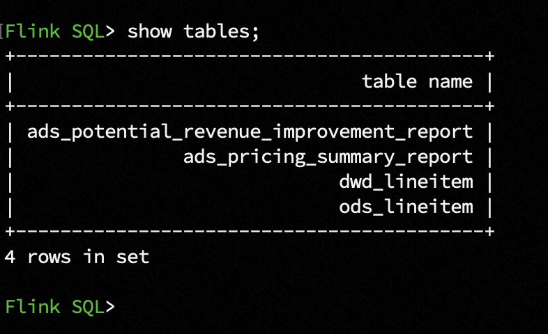

# Real-time Update
*Read this in other languages* [简体中文](https://github.com/LadyForest/flink-table-store-101/blob/master/real-time-update/README.zh.md)

## Brief Introduction
This is a handy demo to illustrate how Flink Table Store (*abbr.* **FTS**) supports real-time records updates at the sacle of ten millions. It utilizes the [TPC-H](https://www.tpc.org/tpch/) toolkit to generate a MySQL order line table with 59 million records as historical full data, and 6 million new orders and 1.5 million old order deletions as incremental data. Then a streaming ETL pipeline synchronizes the changelog to a DWD table of FTS. The FTS table is multi-partitioned by the year and month. The order's `l_shipdate` is deemed as event time which spans 7 years and generates 84 partitions. It is tested that the overall RPS is ??



- About Data Genration  
TPC-H as a classic Ad-hoc query benchmark，it reveals not only the performance of SUT (system under test), but also models all sorts of data requirements close to the business senario in the real-word. This demo chooses Q1 and Q6 to illustrate how FTS supports real-time records updates at the sacle of ten millions.

The schema of `lineitem` is listed as follow, and each row takes up to 128 bytes.
  <table>
      <thead>
          <tr>
              <th>Field</th>
              <th>Type</th>
              <th>Description</th>
          </tr>
      </thead>
      <tbody>
          <tr>
            <td>l_orderkey</td>
            <td>INT NOT NULL</td>
            <td>main order's key, the first part of composite primary key </td>
          </tr>
          <tr>
            <td>l_partkey</td>
            <td>INT NOT NULL</td>
            <td>part's key</td>
          </tr>
          <tr>
            <td>l_suppkey</td>
            <td>INT NOT NULL</td>
            <td>supplier's key</td>
          </tr>
          <tr>
            <td>l_linenumber</td>
            <td>INT NOT NULL</td>
            <td>line order's key, the second part of composite primary key</td>
          </tr>
          <tr>
            <td>l_quantity</td>
            <td>DECIMAL(15, 2) NOT NULL</td>
            <td>part's quantity</td>
          </tr>
          <tr>
            <td>l_extendedprice</td>
            <td>DECIMAL(15, 2) NOT NULL</td>
            <td>part's price</td>
          </tr>
          <tr>
            <td>l_discount</td>
            <td>DECIMAL(15, 2) NOT NULL</td>
            <td>part's discount</td>
          </tr>
          <tr>
            <td>l_tax</td>
            <td>DECIMAL(15, 2) NOT NULL</td>
            <td>part's tax</td>
          </tr>
          <tr>
            <td>l_returnflag</td>
            <td>CHAR(1) NOT NULL</td>
            <td>return flag of order, <code>A</code> stands for accepted, <code>R</code> stands for returned, <code>N</code> stands for none<td>
          </tr>
          <tr>
            <td>l_linestatus</td>
            <td>CHAR(1) NOT NULL</td>
            <td>status of line order, if l_shipdate > 1995-06-17, status is set to <code>O</code>, o.w. <code>F</code></td>
          </tr>
          <tr>
            <td>l_shipdate</td>
            <td>DATE NOT NULL</td>
            <td>date of order shipment</td>
          </tr>
          <tr>
            <td>l_commitdate</td>
            <td>DATE NOT NULL</td>
            <td>date of order placement</td>
          </tr>
          <tr>
            <td>l_receiptdate</td>
            <td>DATE NOT NULL</td>
            <td>date of order receipt</td>
          </tr>
          <tr>
            <td>l_shipinstruct</td>
            <td>CHAR(25) NOT NULL</td>
            <td>ship instructions, such as <code>DELIVER IN PERSON</code>, <code>TAKE BACK RETURN</code>, <code>COLLECT COD</code></td>
          </tr>
          <tr>
            <td>l_shipmode</td>
            <td>CHAR(10) NOT NULL</td>
            <td>E.g. <code>SHIP</code>, <code>AIR</code>, <code>TRUCK</code>, <code>MAIL</code> etc.</td>
          </tr>
          <tr>
            <td>l_comment</td>
            <td>VARCHAR(44) NOT NULL</td>
            <td>comment on orders</td>
          </tr>
      </tbody>
  </table>

- About Business Insights (This is directly from the TPC-H Specification) 
  
  1. Pricing Summary Report Query (Q1)  
    This query reports the amount of business that was billed, shipped, and returned. The Pricing Summary Report Query provides a summary pricing report for all lineitems shipped as of a given date. The date is within 60 - 120 days of the greatest ship date contained in the database. The query lists totals for extended price, discounted extended price, discounted extended price plus tax, average quantity, average extended price, and average discount. These aggregates are grouped by RETURNFLAG and LINESTATUS, and listed in ascending order of RETURNFLAG and LINESTATUS. A count of the number of lineitems in each group is included.
  2. Forecasting Revenue Change Query (Q6)  
    This query quantifies the amount of revenue increase that would have resulted from eliminating certain company- wide discounts in a given percentage range in a given year. Asking this type of "what if" query can be used to look for ways to increase revenues. The Forecasting Revenue Change Query considers all the lineitems shipped in a given year with discounts between DISCOUNT-0.01 and DISCOUNT+0.01. The query lists the amount by which the total revenue would have increased if these discounts had been eliminated for lineitems with l_quantity less than quantity. Note that the potential revenue increase is equal to the sum of [l_extendedprice * l_discount] for all lineitems with discounts and quantities in the qualifying range.

- Brief Step Summary 
  1. Start MySQL container via docker-compose, and generate the lineitem data with scale factor 10 (about 7.4G and 59 million records). The data will be loaded to the table `lineitem` under the database `tpch_s10` automatically. It takes about 2-3 minutes to generate the data, and 15-20 minutes to load the data. And then, the New Sales Refresh Function (RF1) and Old Sales Refresh Function (RF2) will be invoked with 100 as pair number to generate updates.
  2. Download Flink release, Flink CDC connector and FTS dependencies, with tuned configuration, and start SQL CLI
  3. Build pipelines to sync MySQL lineitem to FTS using Flink CDC and compute the query results.


## QuickStart 

### Step1 - Build Dokcer Image & Start Container
Before start, please make sure your local machine has a least 20G free Docker Disk Image. If this condition cannot be met, please modify the docker-compose yaml at line 32 to change `sf` to 1.  
Under `flink-table-store-101/real-time-update` directory, please run
```bash
docker-compose build --no-cache && docker-compose up -d --force-recreate
```
This will invoke the Docker to first build a customized MySQL image which is initialized by TPC-H toolkit with 7.4G data (The whole data is generated with scale factor 10, and contains about 59 million records). The build phase process takes abount to 2-3 minitues (it depends). After the build phase, the container is started with `tpch_s10` as database name，and `lineitem` as table name，and use `LOAD DATA INFILE` to load the data. You can use `docker logs ${container-id}` to track the loading progress, it takes about 15-20 minutes to finish the loading.
- Note1：You can find container-id by command `docker ps`
- Note2：You can enter the internal container by `docker exec -it ${container-id} bash`, and the current working directory should be `/tpch/dbgen`, use `wc -l lineitem.tbl.*` to check the the record num and compare with `lineitem` table.
- Note3：the loading process completes when you saw the following log
    ```plaintext
    Finish loading data, current #(record) is 59986052, and will generate update records in 3 seconds
    ``` 
    the updating process completes when you saw the following log
    ```plaintext
    [System] [MY-010931] [Server] /usr/sbin/mysqld: ready for connections. Version: '8.0.30'  socket: '/var/run/mysqld/mysqld.sock'  port: 3306  MySQL Community Server - GPL.
    ```

### Step2 - Download Flink Release, FTS and Other Dependencies
This demo use Flink 1.14.5 ([flink-1.14.5 download link](https://flink.apache.org/downloads.html#apache-flink-1145)). Besides, the rest dependecies needed are
- Flink MySQL CDC connector 
- FTS compiled on Flink 1.14 profile
- Hadoop Bundle Jar

To ease the preparation，the mentioned dependecies are already packed under the directory of `flink-table-store-101/flink/lib` of this repository, you can directly download and put them under `flink-1.14.5/lib` on your local machine. If you prefer do it by yourself, you can also reach to

- [flink-sql-connector-mysql-cdc-2.3-SNAPSHOT.jar](https://repo1.maven.org/maven2/com/ververica/flink-sql-connector-mysql-cdc/2.3-SNAPSHOT/flink-sql-connector-mysql-cdc-2.3-SNAPSHOT.jar) 
- [Hadoop Bundle Jar](https://repo.maven.apache.org/maven2/org/apache/flink/flink-shaded-hadoop-2-uber/2.8.3-10.0/flink-shaded-hadoop-2-uber-2.8.3-10.0.jar) 
- Switch to master branch and use JKD8 and `mvn clean install -Dmaven.test.skip=true -Pflink-1.14` to build the latest FTS.

Now you can list the `lib` directory to check the completeness of denepdnecies.
```
lib
├── flink-csv-1.14.5.jar
├── flink-dist_2.11-1.14.5.jar
├── flink-json-1.14.5.jar
├── flink-shaded-hadoop-2-uber-2.8.3-10.0.jar
├── flink-shaded-zookeeper-3.4.14.jar
├── flink-sql-connector-mysql-cdc-2.2.1.jar
├── flink-table-store-dist-0.2-SNAPSHOT.jar
├── flink-table_2.11-1.14.5.jar
├── log4j-1.2-api-2.17.1.jar
├── log4j-api-2.17.1.jar
├── log4j-core-2.17.1.jar
└── log4j-slf4j-impl-2.17.1.jar
```

### Step3 - Modify flink-conf and Start Cluster
`vim flink-1.14.5/conf/flink-conf.yaml` with following conf
```yaml
jobmanager.memory.process.size: 4096m
taskmanager.memory.process.size: 4096m
taskmanager.numberOfTaskSlots: 10
parallelism.default: 2
execution.checkpointing.interval: 1min
state.backend: rocksdb
state.backend.incremental: true
jobmanager.execution.failover-strategy: region
execution.checkpointing.checkpoints-after-tasks-finish.enabled: true
```

If you want to observe the verbose info of compaction and commit for FTS, you can pick one or all of the following properties to `log4j.properties` under the `flin-1.14.5/conf` as needed

```
# Log FTS
logger.commit.name = org.apache.flink.table.store.file.operation.FileStoreCommitImpl
logger.commit.level = DEBUG

logger.compaction.name = org.apache.flink.table.store.file.mergetree.compact
logger.compaction.level = DEBUG

logger.enumerator.name = org.apache.flink.table.store.connector.source.ContinuousFileSplitEnumerator
logger.enumerator.level = DEBUG
```

Then start the cluster by `./bin/start-cluster.sh` under `flink-1.14.5`

### Step4 - Start Flink SQL CLI with Initialized Schema SQL
Under `flink-1.14.5` touch a file `schema.sql` and paste the following SQL to initialize.
```sql
-- Switch to streaming mode
SET 'execution.runtime-mode' = 'streaming';

-- Create FTS catalog and set it to current catalog
CREATE CATALOG `table_store` WITH (
    'type' = 'table-store',
    'warehouse' = '/tmp/table-store-101'
);

USE CATALOG `table_store`;

-- ODS table schema

-- Note that under the FTS catalog, when you create some other mirroring tables which need connectors, you need to explictly state them as temporary
CREATE TEMPORARY TABLE `ods_lineitem` (
  `l_orderkey` INT NOT NULL,
  `l_partkey` INT NOT NULL,
  `l_suppkey` INT NOT NULL,
  `l_linenumber` INT NOT NULL,
  `l_quantity` DECIMAL(15, 2) NOT NULL,
  `l_extendedprice` DECIMAL(15, 2) NOT NULL,
  `l_discount` DECIMAL(15, 2) NOT NULL,
  `l_tax` DECIMAL(15, 2) NOT NULL,
  `l_returnflag` CHAR(1) NOT NULL,
  `l_linestatus` CHAR(1) NOT NULL,
  `l_shipdate` DATE NOT NULL,
  `l_commitdate` DATE NOT NULL,
  `l_receiptdate` DATE NOT NULL,
  `l_shipinstruct` CHAR(25) NOT NULL,
  `l_shipmode` CHAR(10) NOT NULL,
  `l_comment` VARCHAR(44) NOT NULL,
  PRIMARY KEY (`l_orderkey`, `l_linenumber`) NOT ENFORCED
) WITH (
  'connector' = 'mysql-cdc',
  'hostname' = '127.0.0.1', -- or 'mysql.docker.internal' if you prefer a host，you can modify your host machine's `/etc/hosts` and add 127.0.0.1 mysql.docker.internal
  'port' = '3307',
  'username' = 'flink',
  'password' = 'flink',
  'database-name' = 'tpch_s10',
  'table-name' = 'lineitem'
);


-- DWD table schema
-- Let `l_shipdate` be the event time to create a partitioned table with `l_year` and `l_month` as partition keys, note that all partition keys are included primary keys as well
CREATE TABLE IF NOT EXISTS `dwd_lineitem` (
  `l_orderkey` INT NOT NULL,
  `l_partkey` INT NOT NULL,
  `l_suppkey` INT NOT NULL,
  `l_linenumber` INT NOT NULL,
  `l_quantity` DECIMAL(15, 2) NOT NULL,
  `l_extendedprice` DECIMAL(15, 2) NOT NULL,
  `l_discount` DECIMAL(15, 2) NOT NULL,
  `l_tax` DECIMAL(15, 2) NOT NULL,
  `l_returnflag` CHAR(1) NOT NULL,
  `l_linestatus` CHAR(1) NOT NULL,
  `l_shipdate` DATE NOT NULL,
  `l_commitdate` DATE NOT NULL,
  `l_receiptdate` DATE NOT NULL,
  `l_shipinstruct` CHAR(25) NOT NULL,
  `l_shipmode` CHAR(10) NOT NULL,
  `l_comment` VARCHAR(44) NOT NULL,
  `l_year` BIGINT NOT NULL,
  PRIMARY KEY (`l_orderkey`, `l_linenumber`, `l_year`, `l_month`) NOT ENFORCED
) PARTITIONED BY (`l_year`, `l_month`) WITH (
  -- 2 bucket under each partition
  'bucket' = '2',
  -- Set changelog-producer as 'input'，this will inform the CDC source not to drop update_before, and the downstream pipelines which consume dwd_lineitem as a source will not generate changelog-normalize operator
  'changelog-producer' = 'input'
);

-- ADS table schema
-- Based on TPC-H Q1，for shipped orders, group them by return flag and line status to calcute the order count, item count, total revenue, average base price, average discount price, and average VAT price
CREATE TABLE IF NOT EXISTS `ads_pricing_summary_report` (
  `l_returnflag` CHAR(1) NOT NULL,
  `l_linestatus` CHAR(1) NOT NULL,
  `sum_quantity` DOUBLE NOT NULL,
  `sum_base_price` DOUBLE NOT NULL,
  `sum_discount_price` DOUBLE NOT NULL,
  `sum_charge_vat_inclusive` DOUBLE NOT NULL,
  `avg_quantity` DOUBLE NOT NULL,
  `avg_base_price` DOUBLE NOT NULL,
  `avg_discount` DOUBLE NOT NULL,
  `count_order` BIGINT NOT NULL
) WITH (
  'bucket' = '2'
);

-- Based on TPC-H Q6, filter some items by specific condition and find out the potential revenue gain if the discount is canceled
CREATE TABLE IF NOT EXISTS `ads_potential_revenue_gain_report` (
  `potential_revenue` DOUBLE NOT NULL
) WITH (
  'bucket' = '1'
);
```
Then start SQL CLI
```bash
./bin/sql-client.sh -i schema.sql
```


### Step5 - Submit ETL Pipelines

- Job1 - `ods_lineitem` to `dwd_lineitem` via Flink MySQL CDC
  ```sql
  SET 'pipeline.name' = 'dwd_lineitem';
  INSERT INTO dwd_lineitem
  SELECT
    `l_orderkey`,
    `l_partkey`,
    `l_suppkey`,
    `l_linenumber`,
    `l_quantity`,
    `l_extendedprice`,
    `l_discount`,
    `l_tax`,
    `l_returnflag`,
    `l_linestatus`,
    `l_shipdate`,
    `l_commitdate`,
    `l_receiptdate`,
    `l_shipinstruct`,
    `l_shipmode`,
    `l_comment`,
    YEAR(`l_shipdate`) AS `l_year`
  FROM `ods_lineitem`;
  ```

- Job2 - Q1 `ads_pricing_summary_report`
  ```sql
  SET 'pipeline.name' = 'ads_pricing_summary_report';
  INSERT INTO `ads_pricing_summary_report`
  SELECT 
    `l_returnflag`,
    `l_linestatus`,
    SUM(`l_quantity`) AS `sum_quantity`,
    SUM(`l_extendedprice`) AS `sum_base_price`,
    SUM(`l_extendedprice` * (1-`l_discount`)) AS `sum_discount_price`, -- aka revenue
    SUM(`l_extendedprice` * (1-`l_discount`) * (1+`l_tax`)) AS `sum_charge_vat_inclusive`,
    AVG(`l_quantity`) AS `avg_quantity`,
    AVG(`l_extendedprice`) AS `avg_base_price`,
    AVG(`l_discount`) AS `avg_discount`,
    COUNT(*) AS `count_order`
  FROM `dwd_lineitem`
  WHERE `l_year` <= 1998
  AND `l_shipdate` <= DATE '1998-12-01' - INTERVAL '90' DAY
  GROUP BY  
    `l_returnflag`,
    `l_linestatus`;
  ```

- Job3 - Q6 `ads_potential_revenue_gain_report`
```sql
  SET 'pipeline.name' = 'ads_potential_revenue_gain_report';
  SET 'parallelism.default' = '1';
  INSERT INTO `ads_potential_revenue_gain_report`
  SELECT 
    SUM(`l_extendedprice` * `l_discount`) AS `revenue`
  FROM `dwd_lineitem`
  WHERE `l_year` = 1994
  AND l_discount BETWEEN 0.06 - 0.01 AND 0.06 + 0.01 AND l_quantity < 24;
```
### Step6 - Ad-hoc query
Switch to batch mode and run the following two queries multiple times to check the refreshment of data. Please note that the interval between same queries should longer than the checkpoint interval.
  1. Swith to batch mode  
      `SET 'execution.runtime-mode' = 'batch';`
  2. Swith result representation to `tableau` mode  
      `SET 'sql-client.execution.result-mode' = 'tableau';`  
  3. Query Q1  
  Set job name  
  `SET 'pipeline.name' = 'Pricing Summary Report';`
  Execute the query  
  `SELECT * FROM ads_pricing_summary_report;`
  4. Query Q6  
  Set job's parallelism to 1  
  `SET 'parallelism.default' = '1';`  
  Set job name  
  `SET 'pipeline.name' = 'Potential Revenue Report';`  
  Execute the query  
  `SELECT * FROM ads_potential_revenue_gain_report;`


### Step7 - Finish Demo & Cleanup
1. Execute `exit;` to exit Flink SQL CLI
2. Under `flink-1.14.5` directory, execute `./bin/stop-cluster.sh` to stop Flink cluster
3. Under `table-store-101/real-time-update` directory, execute 
    ```bash
    docker-compose down && docker rmi real-time-update_mysql-101 && docker volume prune && docker builder prune
    ```
    Note: add `-f` for `prune` at your own risk.
4. Execute `rm -rf /tmp/table-store-101`    