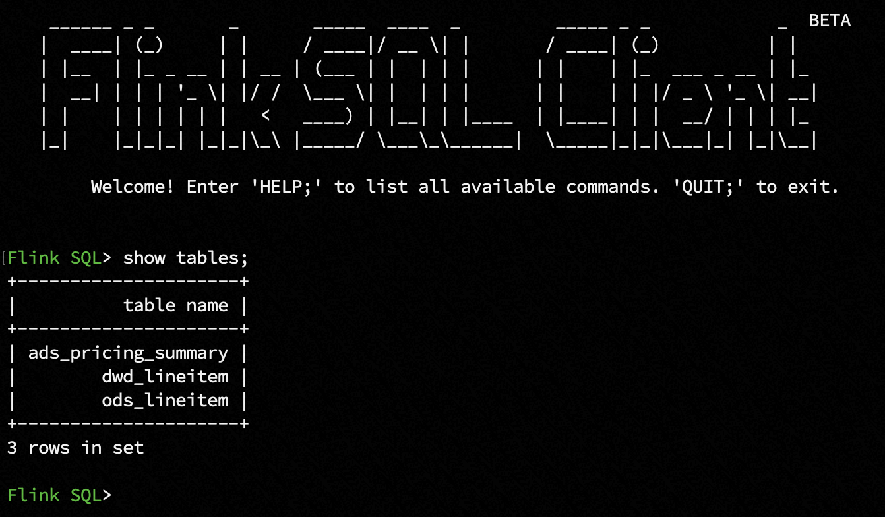
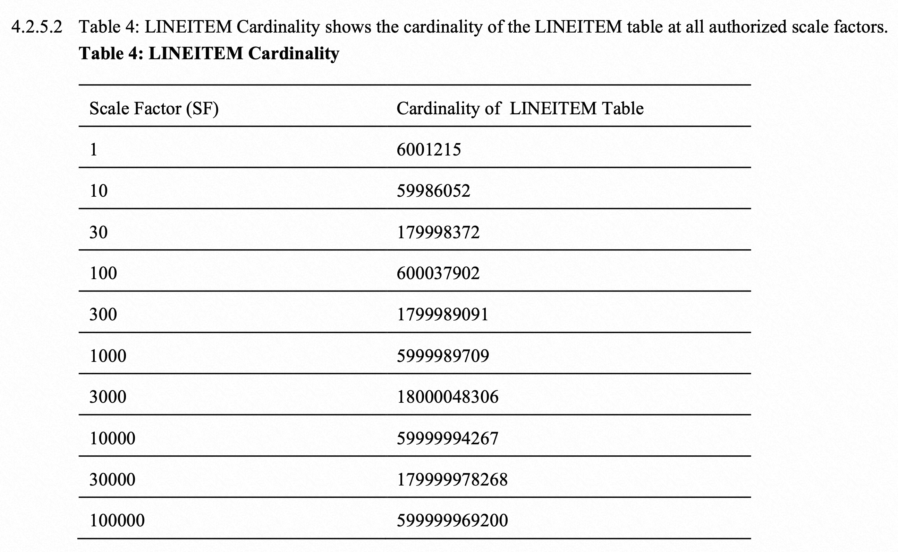

# Real-time Full and Incremental Snapshot Loading - Flink Table Store as a Streaming Lakehouse
*Read this in other languages* [简体中文](https://github.com/LadyForest/flink-table-store-101/blob/master/real-time-update/README.zh.md)

## Brief Introduction
This is a handy demo to illustrate how Flink Table Store (*abbr.* **FTS**) supports real-time records updates at the sacle of ten millions using a laptop. 

The diagram of this demo is listed as follows. The TPC-H toolkit and MySQL is running on a customized docker container, and Flink release and FTS dependencies are downloaded and running on your host machine.
 

It utilizes the [TPC-H](https://www.tpc.org/tpch/) toolkit to generate a MySQL order line table with 59 million records as historical full data. Then a streaming ETL pipeline synchronizes the changelog to a DWD table of FTS. The FTS table is multi-partitioned by the year and month. The order's `l_shipdate` is deemed as event time which spans 7 years and generates 84 partitions. It takes 46 min to finish the full snapshot sync, and the overall RPS is 1.3 million records/min with checkpoint interval as 1 min, parallelism as 2, and bucket number as 2.

<table>
    <thead>
        <tr>
            <th>Configuration</th>
            <th>Value</th>
            <th>Description</th>
        </tr>
    </thead>
    <tbody>
        <tr>
          <td>Records Number</td>
          <td>59,986,052</td>
          <td>Initialized as full snapshot</td>
        </tr>
        <tr>
          <td>Dynamic Partition Number</td>
          <td>84</td>
          <td>`l_year` as dominate partition，`l_month` as secondary partition</td>
        </tr>
        <tr>
          <td>Checkpoint Interval</td>
          <td>1m</td>
          <td>Update frequency</td>
        </tr>
        <tr>
          <td>Parallelism</td>
          <td>2</td>
          <td>Two parallelism on a single laptop</td>
        </tr>
        <tr>
          <td>FTS Bucket Number</td>
          <td>2</td>
          <td>Two buckets under each partition</td>
        </tr>
    </tbody>
</table>

<table>
    <thead>
        <tr>
            <th>Duration(min)</th>
            <th>Records In (million)</th>
        </tr>
    </thead>
    <tbody>
        <tr>
          <td>10</td>
          <td>12</td>
        </tr>
        <tr>
          <td>20</td>
          <td>25</td>
        </tr>
        <tr>
          <td>30</td>
          <td>38</td>
        </tr>
        <tr>
          <td>40</td>
          <td>51</td>
        </tr>
    </tbody>
</table>


### About Data Genration  
TPC-H as a classic Ad-hoc query benchmark, it reveals not only the performance of SUT (system under test), but also models all sorts of data requirements close to the business senario in the real-word. This demo chooses the order line table `lineitem` and  Q1 to illustrate how FTS supports real-time records updates at the sacle of ten millions.

The schema of `lineitem` is listed as follow, and each row takes up to 128 bytes.
  <table>
      <thead>
          <tr>
              <th>Field</th>
              <th>Type</th>
              <th>Description</th>
          </tr>
      </thead>
      <tbody>
          <tr>
            <td>l_orderkey</td>
            <td>INT NOT NULL</td>
            <td>main order's key, the first part of composite primary key </td>
          </tr>
          <tr>
            <td>l_partkey</td>
            <td>INT NOT NULL</td>
            <td>part's key</td>
          </tr>
          <tr>
            <td>l_suppkey</td>
            <td>INT NOT NULL</td>
            <td>supplier's key</td>
          </tr>
          <tr>
            <td>l_linenumber</td>
            <td>INT NOT NULL</td>
            <td>line order's key, the second part of composite primary key</td>
          </tr>
          <tr>
            <td>l_quantity</td>
            <td>DECIMAL(15, 2) NOT NULL</td>
            <td>part's quantity</td>
          </tr>
          <tr>
            <td>l_extendedprice</td>
            <td>DECIMAL(15, 2) NOT NULL</td>
            <td>part's price</td>
          </tr>
          <tr>
            <td>l_discount</td>
            <td>DECIMAL(15, 2) NOT NULL</td>
            <td>part's discount</td>
          </tr>
          <tr>
            <td>l_tax</td>
            <td>DECIMAL(15, 2) NOT NULL</td>
            <td>part's tax</td>
          </tr>
          <tr>
            <td>l_returnflag</td>
            <td>CHAR(1) NOT NULL</td>
            <td>return flag of order, <code>A</code> stands for accepted, <code>R</code> stands for returned, <code>N</code> stands for none<td>
          </tr>
          <tr>
            <td>l_linestatus</td>
            <td>CHAR(1) NOT NULL</td>
            <td>status of line order, if l_shipdate > 1995-06-17, status is set to <code>O</code>, o.w. <code>F</code></td>
          </tr>
          <tr>
            <td>l_shipdate</td>
            <td>DATE NOT NULL</td>
            <td>date of order shipment</td>
          </tr>
          <tr>
            <td>l_commitdate</td>
            <td>DATE NOT NULL</td>
            <td>date of order placement</td>
          </tr>
          <tr>
            <td>l_receiptdate</td>
            <td>DATE NOT NULL</td>
            <td>date of order receipt</td>
          </tr>
          <tr>
            <td>l_shipinstruct</td>
            <td>CHAR(25) NOT NULL</td>
            <td>ship instructions, such as <code>DELIVER IN PERSON</code>, <code>TAKE BACK RETURN</code>, <code>COLLECT COD</code></td>
          </tr>
          <tr>
            <td>l_shipmode</td>
            <td>CHAR(10) NOT NULL</td>
            <td>E.g. <code>SHIP</code>, <code>AIR</code>, <code>TRUCK</code>, <code>MAIL</code> etc.</td>
          </tr>
          <tr>
            <td>l_comment</td>
            <td>VARCHAR(44) NOT NULL</td>
            <td>comment on orders</td>
          </tr>
      </tbody>
  </table>

### About Business Insights

**Pricing Summary Report Query (Q1)**  
This query reports the amount of business that was billed, shipped, and returned. The Pricing Summary Report Query provides a summary pricing report for all lineitems shipped as of a given date. The date is within 60 - 120 days of the greatest ship date contained in the database. The query lists totals for extended price, discounted extended price, discounted extended price plus tax, average quantity, average extended price, and average discount. These aggregates are grouped by RETURNFLAG and LINESTATUS, and listed in ascending order of RETURNFLAG and LINESTATUS. A count of the number of lineitems in each group is included.

## Get Started 

### Brief Step Summary 
  1. Start MySQL container via docker compose, and the container will generate data with scale factor 10 (about 59 million records) and load data to the table `lineitem` under the database `tpch_s10` automatically. It takes about 2-3 minutes to generate the data, and about 15 minutes to load the data. During this period, you can download and prepare Flink, Flink CDC and FTS dependencies, and start Flink cluster and SQL CLI.

  2. After the load finishes, start the streaming CDC job to sync the full snapshot to FTS DWD table.
  
  3. The container maintains a count down timer with 1 hour to invoke TPC-H's New Sales Refresh Function (RF1) and Old Sales Refresh Function (RF2) to continuously generate new orders and delete orders as updates, with certain intervals. The container keeps generating RF1 and RF2 until it is stopped.


### Step1 - Build Dokcer Image & Start Container
Before start, please make sure your local machine has a least 20G free Docker Disk Image. If this condition cannot be met, please modify the docker-compose.yml at line 32 to set `sf=1` to reduce the data size[^1].  
Under `flink-table-store-101/real-time-update` directory, please run
```bash
docker compose build --no-cache && docker compose up -d --force-recreate
```
This will invoke the Docker to first build a customized MySQL image which is initialized by TPC-H toolkit with 59 million records. The build phase  takes abount to 1-2 minitues (it depends). After the build phase, the MySQL container is initialized with `tpch_s10` as database name，and `lineitem` as table name，and use `LOAD DATA INFILE` to load the data. You can use `docker compose logs -f` track the loading progress. It takes about 15 minutes to finish the loading.


Meanwhile, you can also enter the internal container by `docker compose exec -it mysql-101 bash`, and the current working directory should be `/tpch/dbgen`, use `wc -l lineitem.tbl.*` to check the the record num and compare with `lineitem` table.


**The loading process completes when you see the following log, which indicates you can start the Flink CDC job now**

```plaintext
Finish loading data, current #(record) is 59986052
```

### Step2 - Download Flink Release, FTS and Other Dependencies
This demo uses  [Flink 1.14.5 release](https://flink.apache.org/downloads.html#apache-flink-1145), and the extra dependecies needed are
- Flink MySQL CDC connector 
- FTS compiled on master branch with Flink 1.14 profile
- Hadoop Bundle Jar

To ease the preparation，the mentioned dependecies are already packed under the directory of `flink-table-store-101/flink/lib` of this repository, you can directly download and put them under `flink-1.14.5/lib` on your local machine. If you prefer do it by yourself, you can also reach to

- [flink-sql-connector-mysql-cdc-2.3-SNAPSHOT.jar](https://repo1.maven.org/maven2/com/ververica/flink-sql-connector-mysql-cdc/2.3-SNAPSHOT/flink-sql-connector-mysql-cdc-2.3-SNAPSHOT.jar) 
- [Hadoop Bundle Jar](https://repo.maven.apache.org/maven2/org/apache/flink/flink-shaded-hadoop-2-uber/2.8.3-10.0/flink-shaded-hadoop-2-uber-2.8.3-10.0.jar) 
- Switch to master branch and use JKD8 and `mvn clean install -Dmaven.test.skip=true -Pflink-1.14` to build the latest FTS.

Now you can list the `lib` directory to check the completeness of denepdnecies.
```
lib
├── flink-csv-1.14.5.jar
├── flink-dist_2.11-1.14.5.jar
├── flink-json-1.14.5.jar
├── flink-shaded-hadoop-2-uber-2.8.3-10.0.jar
├── flink-shaded-zookeeper-3.4.14.jar
├── flink-sql-connector-mysql-cdc-2.2.1.jar
├── flink-table-store-dist-0.3-SNAPSHOT.jar
├── flink-table_2.11-1.14.5.jar
├── log4j-1.2-api-2.17.1.jar
├── log4j-api-2.17.1.jar
├── log4j-core-2.17.1.jar
└── log4j-slf4j-impl-2.17.1.jar
```

### Step3 - Modify flink-conf and Start Cluster
`vim flink-1.14.5/conf/flink-conf.yaml` with following conf
```yaml
jobmanager.memory.process.size: 4096m
taskmanager.memory.process.size: 4096m
taskmanager.numberOfTaskSlots: 10
parallelism.default: 2
execution.checkpointing.interval: 1min
state.backend: rocksdb
state.backend.incremental: true
jobmanager.execution.failover-strategy: region
execution.checkpointing.checkpoints-after-tasks-finish.enabled: true
```

If you want to observe the verbose info of compaction and commit for FTS, you can pick one or all of the following properties to `log4j.properties` under the `flin-1.14.5/conf` as needed

```
# Log FTS
logger.commit.name = org.apache.flink.table.store.file.operation.FileStoreCommitImpl
logger.commit.level = DEBUG

logger.compaction.name = org.apache.flink.table.store.file.mergetree.compact
logger.compaction.level = DEBUG

logger.enumerator.name = org.apache.flink.table.store.connector.source.ContinuousFileSplitEnumerator
logger.enumerator.level = DEBUG
```

Then start the cluster by `./bin/start-cluster.sh` under `flink-1.14.5`


### Step4 - Start Flink SQL CLI with Initialized Schema SQL
Under `flink-1.14.5` touch a file `schema.sql` and paste the following SQL to initialize.
```sql
-- Switch to streaming mode
SET 'execution.runtime-mode' = 'streaming';

-- Create FTS catalog and set it to current catalog
CREATE CATALOG `table_store` WITH (
    'type' = 'table-store',
    'warehouse' = '/tmp/table-store-101'
);

USE CATALOG `table_store`;

-- ODS table schema

-- Note that under the FTS catalog, when you create some other mirroring tables with connectors, you need to explictly state them as temporary
CREATE TEMPORARY TABLE `ods_lineitem` (
  `l_orderkey` INT NOT NULL,
  `l_partkey` INT NOT NULL,
  `l_suppkey` INT NOT NULL,
  `l_linenumber` INT NOT NULL,
  `l_quantity` DECIMAL(15, 2) NOT NULL,
  `l_extendedprice` DECIMAL(15, 2) NOT NULL,
  `l_discount` DECIMAL(15, 2) NOT NULL,
  `l_tax` DECIMAL(15, 2) NOT NULL,
  `l_returnflag` CHAR(1) NOT NULL,
  `l_linestatus` CHAR(1) NOT NULL,
  `l_shipdate` DATE NOT NULL,
  `l_commitdate` DATE NOT NULL,
  `l_receiptdate` DATE NOT NULL,
  `l_shipinstruct` CHAR(25) NOT NULL,
  `l_shipmode` CHAR(10) NOT NULL,
  `l_comment` VARCHAR(44) NOT NULL,
  PRIMARY KEY (`l_orderkey`, `l_linenumber`) NOT ENFORCED
) WITH (
  'connector' = 'mysql-cdc',
  'hostname' = '127.0.0.1', -- or 'mysql.docker.internal' if you prefer a host，which requires to modify your host machine's `/etc/hosts` and add 127.0.0.1 mysql.docker.internal
  'port' = '3307', -- your host port 3307 maps to container's port 3306
  'username' = 'flink',
  'password' = 'flink',
  'database-name' = 'tpch_s10',
  'table-name' = 'lineitem'
);


-- DWD table schema
-- Let `l_shipdate` be the event time to create a multi-partitioned table with `l_year` and `l_month` as partition keys, note that all partition keys should be included as primary keys as well
CREATE TABLE IF NOT EXISTS `dwd_lineitem` (
  `l_orderkey` INT NOT NULL,
  `l_partkey` INT NOT NULL,
  `l_suppkey` INT NOT NULL,
  `l_linenumber` INT NOT NULL,
  `l_quantity` DECIMAL(15, 2) NOT NULL,
  `l_extendedprice` DECIMAL(15, 2) NOT NULL,
  `l_discount` DECIMAL(15, 2) NOT NULL,
  `l_tax` DECIMAL(15, 2) NOT NULL,
  `l_returnflag` CHAR(1) NOT NULL,
  `l_linestatus` CHAR(1) NOT NULL,
  `l_shipdate` DATE NOT NULL,
  `l_commitdate` DATE NOT NULL,
  `l_receiptdate` DATE NOT NULL,
  `l_shipinstruct` CHAR(25) NOT NULL,
  `l_shipmode` CHAR(10) NOT NULL,
  `l_comment` VARCHAR(44) NOT NULL,
  `l_year` BIGINT NOT NULL,
  `l_month` BIGINT NOT NULL,
  PRIMARY KEY (`l_orderkey`, `l_linenumber`, `l_year`, `l_month`) NOT ENFORCED
) PARTITIONED BY (`l_year`, `l_month`) WITH (
  'bucket' = '2', -- 2 bucket under each partition
  'changelog-producer' = 'input' -- Set changelog-producer as 'input'，this will inform the CDC source not to drop update_before, and the downstream pipelines which consume dwd_lineitem as a source will not generate changelog-normalize operator
);

-- ADS table schema
-- Based on TPC-H Q1，for shipped orders, group them by return flag and line status to calcute the order count, item count, total revenue, average base price, average discount price, and average VAT price
CREATE TABLE IF NOT EXISTS `ads_pricing_summary` (
  `l_returnflag` CHAR(1) NOT NULL,
  `l_linestatus` CHAR(1) NOT NULL,
  `sum_quantity` DOUBLE NOT NULL,
  `sum_base_price` DOUBLE NOT NULL,
  `sum_discount_price` DOUBLE NOT NULL,
  `sum_charge_vat_inclusive` DOUBLE NOT NULL,
  `avg_quantity` DOUBLE NOT NULL,
  `avg_base_price` DOUBLE NOT NULL,
  `avg_discount` DOUBLE NOT NULL,
  `count_order` BIGINT NOT NULL
) WITH (
  'bucket' = '2'
);
```
Then start SQL CLI
```bash
./bin/sql-client.sh -i schema.sql
```


### Step5 - Submit FlinkCDC ETL Pipeline

Before starting this job, please make sure you see the container’s log
```plaintext
Finish loading data, current #(record) is 59986052
```
Job1 - `ods_lineitem` to `dwd_lineitem`
```sql
SET 'pipeline.name' = 'dwd_lineitem';
INSERT INTO dwd_lineitem
SELECT
  `l_orderkey`,
  `l_partkey`,
  `l_suppkey`,
  `l_linenumber`,
  `l_quantity`,
  `l_extendedprice`,
  `l_discount`,
  `l_tax`,
  `l_returnflag`,
  `l_linestatus`,
  `l_shipdate`,
  `l_commitdate`,
  `l_receiptdate`,
  `l_shipinstruct`,
  `l_shipmode`,
  `l_comment`,
  YEAR(`l_shipdate`) AS `l_year`,
  MONTH(`l_shipdate`) AS `l_month`
FROM `ods_lineitem`;
```
You can observe the RPS info from the Flink Web UI, and you might also want to cd `/tmp/table-store-101/default.db/dwd_lineitem` directory to see the table's storage structure, such as snapshot, manifest and sst file etc.


### Step6 - Compute Aggregation & Query Indicators
After completing the full snapshot sync, you can start the ADS aggregation job and query indicators.

- Note: you don't have to wait for the previous job to load all full snapshot, if you do require indicators calculated on an incomplete historical base.

Job2 - Q1 `ads_pricing_summary`
```sql
SET 'pipeline.name' = 'ads_pricing_summary';
INSERT INTO `ads_pricing_summary`
SELECT 
  `l_returnflag`,
  `l_linestatus`,
  SUM(`l_quantity`) AS `sum_quantity`,
  SUM(`l_extendedprice`) AS `sum_base_price`,
  SUM(`l_extendedprice` * (1-`l_discount`)) AS `sum_discount_price`, -- aka revenue
  SUM(`l_extendedprice` * (1-`l_discount`) * (1+`l_tax`)) AS `sum_charge_vat_inclusive`,
  AVG(`l_quantity`) AS `avg_quantity`,
  AVG(`l_extendedprice`) AS `avg_base_price`,
  AVG(`l_discount`) AS `avg_discount`,
  COUNT(*) AS `count_order`
FROM `dwd_lineitem`
WHERE `l_year` <= 1998
AND `l_shipdate` <= DATE '1998-12-01' - INTERVAL '90' DAY
GROUP BY  
  `l_returnflag`,
  `l_linestatus`;
```


Now we can check the indicators by
```sql
SET 'execution.runtime-mode' = 'batch';

SET 'sql-client.execution.result-mode' = 'tableau';

SET 'pipeline.name' = 'Pricing Summary';

SELECT * FROM ads_pricing_summary;
```
You can run this query multiple times to see the results change. Note that the query interval should be longer than the checkpoint interval.


Sometimes we might want to explore the details of order line table for debugging purpose.

```sql
SELECT `l_orderkey`, `l_returnflag`, `l_linestatus`, `l_shipdate` FROM `dwd_lineitem` WHERE `l_year` = 1998 AND `l_month` = 12 AND `l_linenumber` = 2 AND `l_shipinstruct` = 'TAKE BACK RETURN';
```


### Step7 - Observe the Real-time Updates

When all chunks are loaded into MySQL in Step1, the container will start a count down timer with 1 hour. You can see the log message like
```
Refresh Function will be applied after 1h
```

After that, the container will start an infinite loop to call TPC-H's New Sales Refresh Function (RF1) and Old Sales Refresh Function (RF2), which generates new orders and delete orders, as real-time updates to the original `lineitem` table. You can see the log message like

```
Start to apply New Sales Refresh Function (RF1) and Old Sales Refresh Function (RF2) in infinite loop
TPC-H Population Generator (Version 3.0.0) starts to generate update set with sf = 10 and total pair = 100

Start to apply New Sales Refresh Function (RF1) for pair 10
Start to apply Old Sales Refresh Function (RF2) for pair 10
Start to apply New Sales Refresh Function (RF1) for pair 20
Start to apply Old Sales Refresh Function (RF2) for pair 20
...
```
And then, you can notice that the incremental snapshot are sync to `dwd_lineitem`.


### Step8 - Finish Demo & Cleanup
1. Execute `exit;` to exit Flink SQL CLI
2. Under `flink-1.14.5` directory, execute `./bin/stop-cluster.sh` to stop Flink cluster
3. Under `table-store-101/real-time-update` directory, execute 
    ```bash
    docker compose down && docker rmi real-time-update_mysql-101 && docker volume prune && docker builder prune
    ```
    Note: add `-f` for `prune` at your own risk.
4. Execute `rm -rf /tmp/table-store-101`    

## Appendix  
[^1]: Relationship between TPC-H scale factor and `lineitem` cardinality

