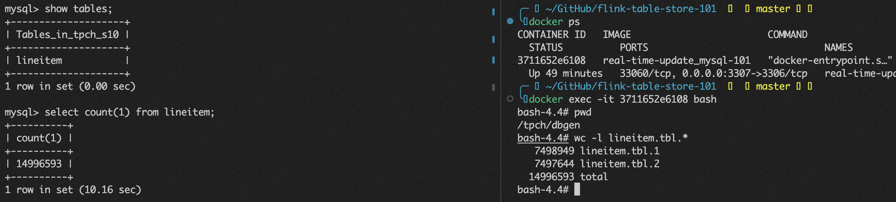

# 实时更新
*其它语言版本* [English](https://github.com/LadyForest/flink-table-store-101/tree/master/real-time-update)

## 用例简介
Flink Table Store（以下简称 **FTS**）在千万级数据规模的实时更新场景展示

- 关于数据生成  
[TPC-H](https://www.tpc.org/tpch/) 作为一个经典的 Ad-hoc query 性能测试 Benchmark，其自身所包含的数据 relation 和 22 个 query 已经涵盖了丰富的商业场景（统计指标与大部分电商需求十分类似）。本用例选取了针对单表查询的 Q1 和 Q6，包含 2 个常见 BI 需求，展示在千万级别数据量时 FTS 的实时更新能力

- 商业洞察需求  
  
  1. 对已发货的订单，根据订单状态和收货状态统计订单数、商品数、总营业额、总利润、平均出厂价、平均折扣价、平均折扣含税价等指标（对应 TPC-H Q1）
  2. 通过特定的销量和折扣过滤出一批商品，如果取消折扣，能在多大程度上降低成本，提升利润（对应 TPC-H Q6）

- 步骤简介 
  1. 通过 docker-compose 启动服务，以 scale factor 10, chunk number 8 初始化 MySQL container, 每个 chunk 约有 750 万条数据, 导入前 2 个 chunk，产生约 1千 600 万条订单明细（耗时约 3 分钟），产生的文件名为 `lineitem.tbl.1`, `lineitem.tbl.2`, 并自动导入到名为 `tpch_s10` 数据库下面的 `lineitem` 表
  2. 在本地下载 Flink、Flink CDC 及 FTS 相关依赖，修改配置，启动 SQL CLI
  3. 将 MySQL 订单明细表通过 Flink CDC 同步到 FTS 对应表，并启动 Q1 和 Q6 的实时写入任务
  4. 通过脚本触发生成剩余 6 个 chunk 作为 INSERT 消息，并以固定间隔向 `lineitem` 插入 RF2 产生的删除订单作为 DELETE 消息，在上一步中查看更新结果


## 快速开始 

### 第一步：构建镜像，启动容器服务
在开始之前，请确保本机 Docker Disk Image 至少有 20G 空间，如果无法调整，请将 docker-compose 文件中第 32 行 `sf` 改为 1  
在 `flink-table-store-101/real-time-update` 目录下运行
```bash
docker-compose build --no-cache && docker-compose up -d --force-recreate
```
构建镜像阶段将会使用 TPC-H 自带工具产生约 2G 数据 (scale factor = 10, 分为 8 个 chunk，每个 chunk 记录数约为 749 万条)，整个构建过程大约需要 3 分钟左右，镜像构建完成后容器启动，将会自动创建名为 `tpch_s10` 的数据库，在其中创建 `lineitem` 表，并通过 `LOAD DATA INFILE` 自动导入前 2 个 chunk。可以通过 `docker logs ${container-id}` 来查看导入进度，此过程耗时约 3-4 分钟
- 注1：container-id 可以通过 `docker ps` 命令获取
- 注2：还可以通过 `docker exec -it ${container-id} bash` 进入容器内部，当前工作目录即为 `/tpch/dbgen`, 用 `wc -l lineitem.tbl.*` 查看产生的数据行数；与导入 MySQL 的数据进行比对
  
- 注3：当看到如下日志时，说明导入已经完成
    ```plaintext
    [System] [MY-010931] [Server] /usr/sbin/mysqld: ready for connections. Version: '8.0.30'  socket: '/var/run/mysqld/mysqld.sock'  port: 3306  MySQL Community Server - GPL.
    ```

### 第二步：下载 Flink、FTS 及其他所需依赖
Demo 运行使用 Flink 1.14.5 版本（ [flink-1.14.5 下载链接](https://flink.apache.org/downloads.html#apache-flink-1145) ），需要的其它依赖如下
- Flink MySQL CDC Connector 
- 及基于 Flink 1.14 编译的 FTS
- Hadoop Bundle Jar

为方便操作，您可以直接在本项目的 `flink/lib` 目录下载所有依赖，并放置于 `flink-1.14.5/lib` 目录下，也可以自行下载及编译

- [flink-sql-connector-mysql-cdc-2.3-SNAPSHOT.jar](https://repo1.maven.org/maven2/com/ververica/flink-sql-connector-mysql-cdc/2.3-SNAPSHOT/flink-sql-connector-mysql-cdc-2.3-SNAPSHOT.jar) 
- [Hadoop Bundle Jar](https://repo.maven.apache.org/maven2/org/apache/flink/flink-shaded-hadoop-2-uber/2.8.3-10.0/flink-shaded-hadoop-2-uber-2.8.3-10.0.jar) 
- 使用 JKD8 及 `mvn clean install -Dmaven.test.skip=true -Pflink-1.14` [编译](https://nightlies.apache.org/flink/flink-table-store-docs-master/docs/engines/build/) 最新发布的 FTS release-0.2 版本，注意切换到 release-0.2 分支

上述步骤完成后，lib 目录结构如图所示  
```
lib
├── flink-csv-1.14.5.jar
├── flink-dist_2.11-1.14.5.jar
├── flink-json-1.14.5.jar
├── flink-shaded-hadoop-2-uber-2.8.3-10.0.jar
├── flink-shaded-zookeeper-3.4.14.jar
├── flink-sql-connector-mysql-cdc-2.2.1.jar
├── flink-table-store-dist-0.2-SNAPSHOT.jar
├── flink-table_2.11-1.14.5.jar
├── log4j-1.2-api-2.17.1.jar
├── log4j-api-2.17.1.jar
├── log4j-core-2.17.1.jar
└── log4j-slf4j-impl-2.17.1.jar
```

### 第三步：修改 flink-conf 配置文件并启动集群
`vim flink-1.14.5/conf/flink-conf.yaml` 文件，按如下配置修改
```yaml
jobmanager.memory.process.size: 4096m
taskmanager.memory.process.size: 4096m
taskmanager.numberOfTaskSlots: 10
parallelism.default: 2
execution.checkpointing.interval: 1min
state.backend: rocksdb
state.backend.incremental: true
jobmanager.execution.failover-strategy: region
execution.checkpointing.checkpoints-after-tasks-finish.enabled: true
```
然后在 `flink-1.14.5` 目录下执行 `./bin/start-cluster.sh`

### 第四步：初始化表 schema 并启动 Flink SQL CLI
在 `flink-1.14.5` 目录下新建 `schema.sql` 文件，配置用例所需表的 schema 和 FTS Catalog 作为 init sql
```sql
-- 设置使用流模式
SET 'execution.runtime-mode' = 'streaming';

-- 创建并使用 FTS Catalog
CREATE CATALOG `table_store` WITH (
    'type' = 'table-store',
    'warehouse' = '/tmp/table-store-101'
);

USE CATALOG `table_store`;

-- ODS table schema

-- 注意在 FTS Catalog 下，创建使用其它连接器的表时，需要将表声明为临时表
CREATE TEMPORARY TABLE `ods_lineitem` (
  `l_orderkey` INT NOT NULL,
  `l_partkey` INT NOT NULL,
  `l_suppkey` INT NOT NULL,
  `l_linenumber` INT NOT NULL,
  `l_quantity` DECIMAL(15, 2) NOT NULL,
  `l_extendedprice` DECIMAL(15, 2) NOT NULL,
  `l_discount` DECIMAL(15, 2) NOT NULL,
  `l_tax` DECIMAL(15, 2) NOT NULL,
  `l_returnflag` CHAR(1) NOT NULL,
  `l_linestatus` CHAR(1) NOT NULL,
  `l_shipdate` DATE NOT NULL,
  `l_commitdate` DATE NOT NULL,
  `l_receiptdate` DATE NOT NULL,
  `l_shipinstruct` CHAR(25) NOT NULL,
  `l_shipmode` CHAR(10) NOT NULL,
  `l_comment` VARCHAR(44) NOT NULL,
  PRIMARY KEY (`l_orderkey`, `l_linenumber`) NOT ENFORCED
) WITH (
  'connector' = 'mysql-cdc',
  'hostname' = '127.0.0.1', -- 如果想使用 host，可以修改宿主机 /etc/hosts 加入 127.0.0.1 mysql.docker.internal
  'port' = '3307',
  'username' = 'flink',
  'password' = 'flink',
  'database-name' = 'tpch_s10',
  'table-name' = 'lineitem'
);


-- DWD table schema
-- 以 `l_shipdate` 为业务日期，创建以 `l_year`+ `l_month` 两级分区的表，注意所有 partition key 都需要声明在 primary key 中
CREATE TABLE IF NOT EXISTS `dwd_lineitem` (
  `l_orderkey` INT NOT NULL,
  `l_partkey` INT NOT NULL,
  `l_suppkey` INT NOT NULL,
  `l_linenumber` INT NOT NULL,
  `l_quantity` DECIMAL(15, 2) NOT NULL,
  `l_extendedprice` DECIMAL(15, 2) NOT NULL,
  `l_discount` DECIMAL(15, 2) NOT NULL,
  `l_tax` DECIMAL(15, 2) NOT NULL,
  `l_returnflag` CHAR(1) NOT NULL,
  `l_linestatus` CHAR(1) NOT NULL,
  `l_shipdate` DATE NOT NULL,
  `l_commitdate` DATE NOT NULL,
  `l_receiptdate` DATE NOT NULL,
  `l_shipinstruct` CHAR(25) NOT NULL,
  `l_shipmode` CHAR(10) NOT NULL,
  `l_comment` VARCHAR(44) NOT NULL,
  `l_year` BIGINT NOT NULL,
  `l_month` BIGINT NOT NULL,
  PRIMARY KEY (`l_orderkey`, `l_linenumber`, `l_year`, `l_month`) NOT ENFORCED
) PARTITIONED BY (`l_year`, `l_month`) WITH (
  -- 每个 partition 下设置 2 个 bucket
  'bucket' = '2',
  -- 设置 changelog-producer 为 'input'，这会使得上游 CDC Source 不丢弃 update_before，并且下游消费 dwd_lineitem 时没有 changelog-normalize 节点
  'changelog-producer' = 'input'
);

-- ADS table schema
-- 基于 TPC-H Q1，对已发货的订单，根据订单状态和收货状态统计订单数、商品数、总营业额、总利润、平均出厂价、平均折扣价、平均折扣含税价等指标
CREATE TABLE IF NOT EXISTS `ads_pricing_summary_report` (
  `l_returnflag` CHAR(1) NOT NULL,
  `l_linestatus` CHAR(1) NOT NULL,
  `sum_quantity` DOUBLE NOT NULL,
  `sum_base_price` DOUBLE NOT NULL,
  `sum_discount_price` DOUBLE NOT NULL,
  `sum_charge_vat_inclusive` DOUBLE NOT NULL,
  `avg_quantity` DOUBLE NOT NULL,
  `avg_base_price` DOUBLE NOT NULL,
  `avg_discount` DOUBLE NOT NULL,
  `count_order` BIGINT NOT NULL
) WITH (
  'bucket' = '2'
);

-- 基于 TPC-H Q6，通过特定的销量和折扣过滤出一批商品，如果对其取消折扣，能在多大程度上降低成本，提升利润
CREATE TABLE IF NOT EXISTS `ads_potential_revenue_improvement_report` (
  `potential_revenue` DOUBLE NOT NULL
) WITH (
  'bucket' = '1'
);
```
然后运行 SQL CLI
```bash
./bin/sql-client.sh -i schema.sql
```


### 第五步：提交作业

- 任务1：通过 Flink MySQL CDC 同步 `ods_lineitem` 到 `dwd_lineitem`
  ```sql
  -- 设置作业名
  SET 'pipeline.name' = 'dwd_lineitem';
  INSERT INTO dwd_lineitem
  SELECT
    `l_orderkey`,
    `l_partkey`,
    `l_suppkey`,
    `l_linenumber`,
    `l_quantity`,
    `l_extendedprice`,
    `l_discount`,
    `l_tax`,
    `l_returnflag`,
    `l_linestatus`,
    `l_shipdate`,
    `l_commitdate`,
    `l_receiptdate`,
    `l_shipinstruct`,
    `l_shipmode`,
    `l_comment`,
    YEAR(`l_shipdate`) AS `l_year`,
    MONTH(`l_shipdate`) AS `l_month`
  FROM `ods_lineitem`;
  ```

- 任务2：写入结果表 `ads_pricing_summary_report`
  ```sql
  -- 设置作业名
  SET 'pipeline.name' = 'ads_pricing_summary_report';
  INSERT INTO `ads_pricing_summary_report`
  SELECT 
    `l_returnflag`,
    `l_linestatus`,
    SUM(`l_quantity`) AS `sum_quantity`,
    SUM(`l_extendedprice`) AS `sum_base_price`,
    SUM(`l_extendedprice` * (1-`l_discount`)) AS `sum_discount_price`, -- aka revenue
    SUM(`l_extendedprice` * (1-`l_discount`) * (1+`l_tax`)) AS `sum_charge_vat_inclusive`,
    AVG(`l_quantity`) AS `avg_quantity`,
    AVG(`l_extendedprice`) AS `avg_base_price`,
    AVG(`l_discount`) AS `avg_discount`,
    COUNT(*) AS `count_order`
  FROM `dwd_lineitem`
  WHERE (`l_year` < 1998 OR (`l_year` = 1998 AND `l_month` <= 9))
  AND `l_shipdate` <= DATE '1998-12-01' - INTERVAL '90' DAY
  GROUP BY  
    `l_returnflag`,
    `l_linestatus`;
  ```

-- 任务3：写入结果表 `ads_potential_revenue_improvement_report`
```sql
  SET 'pipeline.name' = 'ads_potential_revenue_improvement_report';
  -- 设置作业并发
  SET 'parallelism.default' = '1';
  INSERT INTO `ads_potential_revenue_improvement_report`
  SELECT 
    SUM(`l_extendedprice` * `l_discount`) AS `revenue`
  FROM `dwd_lineitem`
  WHERE `l_year` = 1994
  AND l_discount BETWEEN 0.06 - 0.01 AND 0.06 + 0.01 AND l_quantity < 24;
```
### 第六步：执行 Ad-hoc query
在 streaming 模式下同时查询 Q1 和 Q6 需要两个 SQL CLI
- 在 `/flink` 目录下执行 `./bin/sql-client.sh -i schema.sql` 打开第二个 CLI
- 在两个 CLI 下 分别执行
  ```sql
  SET 'sql-client.execution.result-mode' = 'table';
  SET 'execution.runtime-mode' = 'streaming';
  SET 'pipeline.name' = 'Q1-Pricing Summary Report';
  SET 'parallelism.default' = '2';
  SELECT * FROM ads_pricing_summary_report;
  ```
  ```sql
  SET 'sql-client.execution.result-mode' = 'table';
  SET 'execution.runtime-mode' = 'streaming';
  SET 'pipeline.name' = 'Q6-Potential Revenue Report';
  SET 'parallelism.default' = '1';
  SELECT * FROM ads_potential_revenue_improvement_report;
  ```