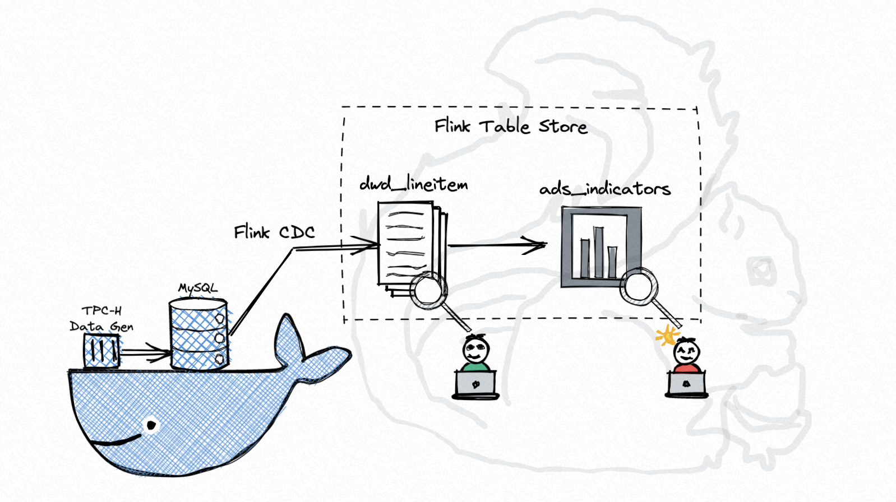
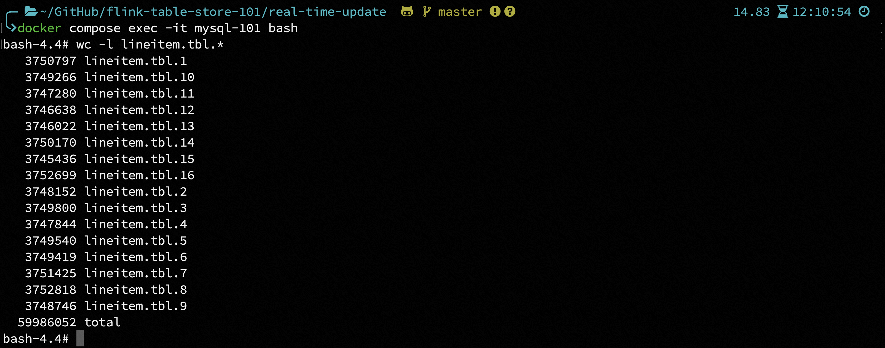
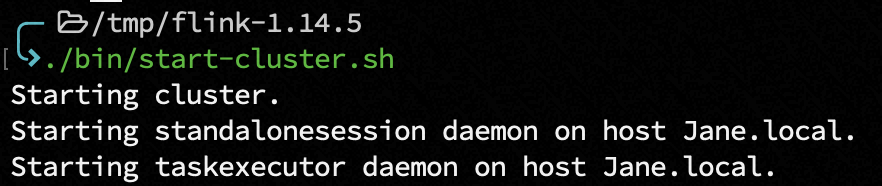
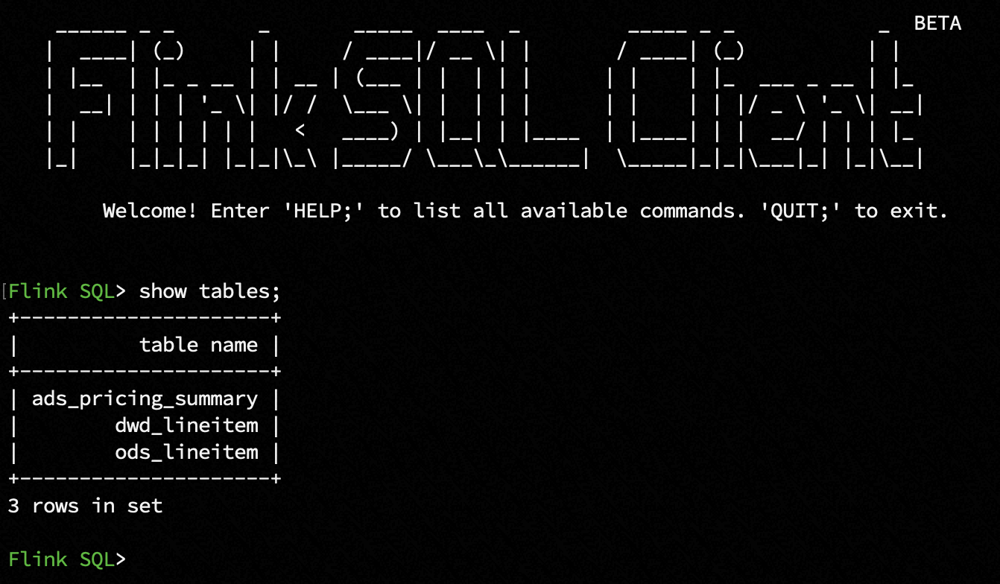
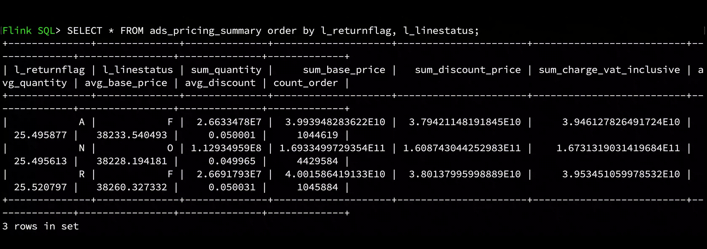
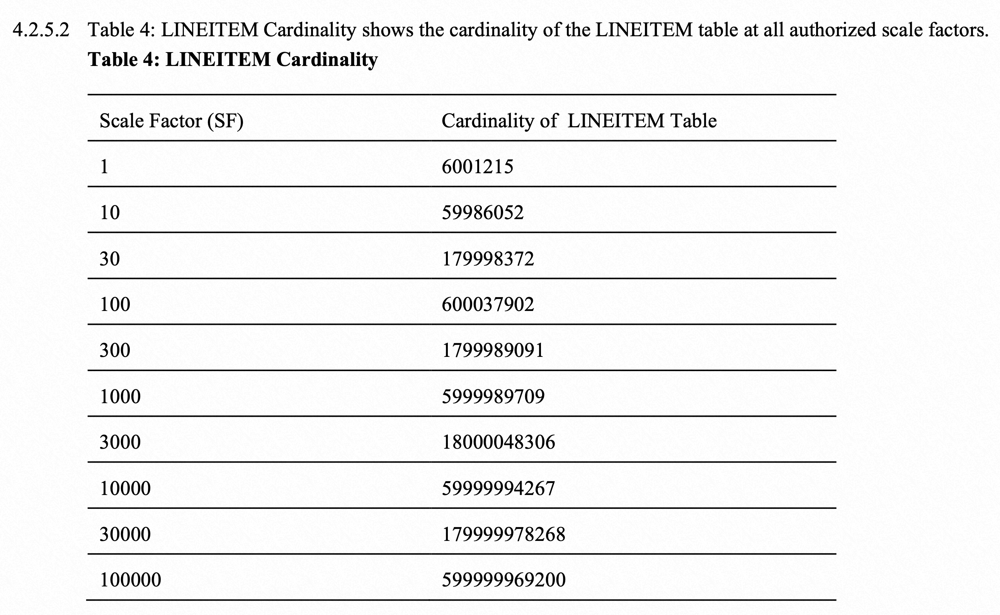

# 全增量一体 CDC 实时入湖
*其它语言版本* [English](https://github.com/LadyForest/flink-table-store-101/tree/master/real-time-update)

## 用例简介
Flink Table Store（以下简称 **FTS**）作为支持实时更新的高性能湖存储，本用例展示了在千万数据规模下使用全量 + 增量一体化同步 MySQL 订单表到 FTS 明细表、下游计算聚合及持续消费更新的能力。整体流程如下图所示，其中 TPC-H 数据生成器和 MySQL 运行在 docker 容器内，本机只需要下载 Flink 包及 FTS 相关依赖即可。

 

数据源由 [TPC-H](https://www.tpc.org/tpch/) toolkit 生成并导入 MySQL，在写入 FTS 时以 `l_shipdate` 字段作为业务时间定义分区 `l_year` 和 `l_month`，时间跨度从 1992.1-1998.12，动态写入 84 个分区，详细配置如下表所示。

<table>
    <thead>
        <tr>
            <th>Configuration</th>
            <th>Value</th>
            <th>Description</th>
        </tr>
    </thead>
    <tbody>
        <tr>
          <td>记录数</td>
          <td>59,986,052</td>
          <td>全量阶段同步数据量</td>
        </tr>
        <tr>
          <td>动态写入分区数</td>
          <td>84</td>
          <td>`l_year` 为一级分区，`l_month` 为二级分区</td>
        </tr>
        <tr>
          <td>Checkpoint Interval</td>
          <td>1m</td>
          <td>数据更新频率</td>
        </tr>
        <tr>
          <td>Parallelism</td>
          <td>2</td>
          <td>单机 2 个并发</td>
        </tr>
        <tr>
          <td>FTS Bucket Number</td>
          <td>2</td>
          <td>每个分区下生成 2 个 bucket</td>
        </tr>
    </tbody>
</table>

经测试，在单机并发为 2，checkpoint interval 为 1 min 的配置下（每分钟更新可见）46 min 内写入 59.9 million 全量数据，每 10 min 的写入性能如下表所示，平均写入性能在 1.3 million/min。

<table>
    <thead>
        <tr>
            <th>Duration(min)</th>
            <th>Records In (million)</th>
        </tr>
    </thead>
    <tbody>
        <tr>
          <td>10</td>
          <td>12</td>
        </tr>
        <tr>
          <td>20</td>
          <td>25</td>
        </tr>
        <tr>
          <td>30</td>
          <td>38</td>
        </tr>
        <tr>
          <td>40</td>
          <td>51</td>
        </tr>
    </tbody>
</table>

从作业运行图中可以观测到每 10 min 作业写入的数据量，在 46 min 时全量同步完成，开始持续监听增量数据。
  

### 关于数据生成  

TPC-H 作为一个经典的 Ad-hoc query 性能测试 benchmark，其包含的数据模型与真实的商业场景十分类似。本用例选取其中订单明细表 `lineitem` 和针对它的单表查询 Q1（下文会有详细说明）  

`lineitem` schema 如下表所示，每行记录在 128 bytes 左右
  <table>
      <thead>
          <tr>
              <th>字段</th>
              <th>类型</th>
              <th>描述</th>
          </tr>
      </thead>
      <tbody>
          <tr>
            <td>l_orderkey</td>
            <td>INT NOT NULL</td>
            <td>主订单 key，即主订单 id，联合主键第一位</td>
          </tr>
          <tr>
            <td>l_partkey</td>
            <td>INT NOT NULL</td>
            <td>配件 key，即商品 id</td>
          </tr>
          <tr>
            <td>l_suppkey</td>
            <td>INT NOT NULL</td>
            <td>供应商 key，即卖家 id</td>
          </tr>
          <tr>
            <td>l_linenumber</td>
            <td>INT NOT NULL</td>
            <td>子订单 key，即子订单 id，联合主键第二位</td>
          </tr>
          <tr>
            <td>l_quantity</td>
            <td>DECIMAL(15, 2) NOT NULL</td>
            <td>商品数量</td>
          </tr>
          <tr>
            <td>l_extendedprice</td>
            <td>DECIMAL(15, 2) NOT NULL</td>
            <td>商品价格</td>
          </tr>
          <tr>
            <td>l_discount</td>
            <td>DECIMAL(15, 2) NOT NULL</td>
            <td>商品折扣</td>
          </tr>
          <tr>
            <td>l_tax</td>
            <td>DECIMAL(15, 2) NOT NULL</td>
            <td>商品税</td>
          </tr>
          <tr>
            <td>l_returnflag</td>
            <td>CHAR(1) NOT NULL</td>
            <td>订单签收标志，<code>A</code> 代表 accepted 签收，<code>R<code> 代表 returned 拒收，<code>N</code> 代表 none 未知</td>
          </tr>
          <tr>
            <td>l_linestatus</td>
            <td>CHAR(1) NOT NULL</td>
            <td>子订单状态，发货日期晚于 1995-06-17 之前的订单标记为 <code>O</code>，否则标记为 <code>F</code></td>
          </tr>
          <tr>
            <td>l_shipdate</td>
            <td>DATE NOT NULL</td>
            <td>订单发货日期</td>
          </tr>
          <tr>
            <td>l_commitdate</td>
            <td>DATE NOT NULL</td>
            <td>订单提交日期</td>
          </tr>
          <tr>
            <td>l_receiptdate</td>
            <td>DATE NOT NULL</td>
            <td>收货日期</td>
          </tr>
          <tr>
            <td>l_shipinstruct</td>
            <td>CHAR(25) NOT NULL</td>
            <td>收货信息，比如 <code>DELIVER IN PERSON</code> 本人签收，<code>TAKE BACK RETURN</code> 退货，<code>COLLECT COD</code> 货到付款</td>
          </tr>
          <tr>
            <td>l_shipmode</td>
            <td>CHAR(10) NOT NULL</td>
            <td>快递模式，有 <code>SHIP</code> 海运，<code>AIR</code> 空运，<code>TRUCK</code> 陆运，<code>MAIL</code> 邮递等类型</td>
          </tr>
          <tr>
            <td>l_comment</td>
            <td>VARCHAR(44) NOT NULL</td>
            <td>订单注释</td>
          </tr>
      </tbody>
  </table>

### 业务需求（TPC-H Q1）  

对发货日期在一定范围内的订单，根据订单状态和收货状态统计订单数、商品数、总营业额、总利润、平均出厂价、平均折扣价、平均折扣含税价等指标。

## 快速开始 

### 步骤简介
本用例会在第一步中将全量订单数据（约 59.9 million）导入 MySQL container，预计耗时 15 min，在此期间您可以准备好 Flink 及 FTS 等环境，等待数据导入完毕，然后启动 Flink 作业。本案例中使用的 MySQL container 会在上述数据导入 MySQL 后自动倒计时 1 小时，然后开始持续触发 TPC-H 产生 RF1（新增订单）和 RF2（删除已有订单）来模拟增量更新（每组新增和删除之间间隔 10s）。以 100 组更新为例，将会产生 6 million 新增订单和 1.5 million 删除订单（注：TPC-H 产生的删除订单为主订单 ID，由于 `lineitem` 存在联合主键，故实际删除数据量稍大于 1.5 million）。此过程会一直持续，直至 container 停止。

### 第一步：构建镜像，启动容器服务
在开始之前，请确保本机 Docker Disk Image 至少有 20G 空间，若空间不足，请将 docker-compose.yml 文件中第 32 行 `sf` 改为 1（减少数据规模，此时生成约 736M 数据[^1]） 

在 `flink-table-store-101/real-time-update` 目录下运行
```bash
docker compose build --no-cache && docker compose up -d --force-recreate
```

该命令首先会构建一个自定义 MySQL 镜像，构建完成后容器启动，将会自动创建名为 `tpch_s10` 的数据库，在其中创建 `lineitem` 表，通过 TPC-H 工具自动产生约 7.4G 数据 (scale factor = 10)  ，并自动导入数据到 MySQL。您可以通过 `docker compose logs -f` 来查看导入进度，此过程耗时约 15 min


与此同时，您还可以通过 `docker compose exec -it mysql-101 bash` 进入容器内部，当前工作目录即为 `/tpch/dbgen`, 用 `wc -l lineitem.tbl.*` 查看产生的数据行数；与导入 MySQL 的数据进行比对



**当看到如下日志时，说明全量数据已经导入完成，可以启动 FlinkCDC 任务进行全量同步了** 
```plaintext
Finish loading data, current #(record) is 59986052
```

### 第二步：下载 Flink、FTS 及其他所需依赖
Demo 运行使用 Flink 1.14.5 版本（ [flink-1.14.5 下载链接](https://flink.apache.org/downloads.html#apache-flink-1145) ），需要的其它依赖如下
- Flink MySQL CDC connector 
- 基于 Flink 1.14 编译的 FTS
- Hadoop Bundle Jar

为方便操作，您可以直接在本项目的 `flink-table-store-101/flink/lib` 目录下载所有依赖，并放置于本地 `flink-1.14.5/lib` 目录下，也可以自行下载及编译

- [flink-sql-connector-mysql-cdc-2.2.1.jar](https://repo1.maven.org/maven2/com/ververica/flink-sql-connector-mysql-cdc/2.2.1/flink-sql-connector-mysql-cdc-2.2.1.jar) 
- [Hadoop Bundle Jar](https://repo.maven.apache.org/maven2/org/apache/flink/flink-shaded-hadoop-2-uber/2.8.3-10.0/flink-shaded-hadoop-2-uber-2.8.3-10.0.jar) 
- 获取最新 master 分支并使用 JKD8 编译 FTS release-0.3 版本  
  `mvn clean install -Dmaven.test.skip=true -Pflink-1.14` 

上述步骤完成后，lib 目录结构如图所示  
```
lib
├── flink-csv-1.14.5.jar
├── flink-dist_2.11-1.14.5.jar
├── flink-json-1.14.5.jar
├── flink-shaded-hadoop-2-uber-2.8.3-10.0.jar
├── flink-shaded-zookeeper-3.4.14.jar
├── flink-sql-connector-mysql-cdc-2.2.1.jar
├── flink-table-store-dist-0.2-SNAPSHOT.jar
├── flink-table_2.11-1.14.5.jar
├── log4j-1.2-api-2.17.1.jar
├── log4j-api-2.17.1.jar
├── log4j-core-2.17.1.jar
└── log4j-slf4j-impl-2.17.1.jar
```

### 第三步：修改 flink-conf 配置文件并启动集群
`vim flink-1.14.5/conf/flink-conf.yaml` 文件，按如下配置修改
```yaml
jobmanager.memory.process.size: 4096m
taskmanager.memory.process.size: 4096m
taskmanager.numberOfTaskSlots: 8
parallelism.default: 2
execution.checkpointing.interval: 1min
state.backend: rocksdb
state.backend.incremental: true
execution.checkpointing.checkpoints-after-tasks-finish.enabled: true
```

若想观察 FTS 的异步合并、Snapshot 提交及流读等信息，可以在 `flink-1.14.5/conf` 目录下修改 log4j.properties 文件，按需增加如下配置
```
# Log FTS
logger.commit.name = org.apache.flink.table.store.file.operation.FileStoreCommitImpl
logger.commit.level = DEBUG

logger.compaction.name = org.apache.flink.table.store.file.mergetree.compact
logger.compaction.level = DEBUG

logger.enumerator.name = org.apache.flink.table.store.connector.source.ContinuousFileSplitEnumerator
logger.enumerator.level = DEBUG
```
这里我们只开启提交的 DEBUG，然后在 `flink-1.14.5` 目录下执行 `./bin/start-cluster.sh`



### 第四步：初始化表 schema 并启动 Flink SQL CLI
在 `flink-1.14.5` 目录下新建 `schema.sql` 文件，配置用例所需表的 schema 和 FTS Catalog 作为 init sql
```sql
-- 设置使用流模式
SET 'execution.runtime-mode' = 'streaming';

-- 创建并使用 FTS Catalog
CREATE CATALOG `table_store` WITH (
    'type' = 'table-store',
    'warehouse' = '/tmp/table-store-101'
);

USE CATALOG `table_store`;

-- ODS table schema

-- 注意在 FTS Catalog 下，创建使用其它连接器的表时，需要将表声明为临时表
CREATE TEMPORARY TABLE `ods_lineitem` (
  `l_orderkey` INT NOT NULL,
  `l_partkey` INT NOT NULL,
  `l_suppkey` INT NOT NULL,
  `l_linenumber` INT NOT NULL,
  `l_quantity` DECIMAL(15, 2) NOT NULL,
  `l_extendedprice` DECIMAL(15, 2) NOT NULL,
  `l_discount` DECIMAL(15, 2) NOT NULL,
  `l_tax` DECIMAL(15, 2) NOT NULL,
  `l_returnflag` CHAR(1) NOT NULL,
  `l_linestatus` CHAR(1) NOT NULL,
  `l_shipdate` DATE NOT NULL,
  `l_commitdate` DATE NOT NULL,
  `l_receiptdate` DATE NOT NULL,
  `l_shipinstruct` CHAR(25) NOT NULL,
  `l_shipmode` CHAR(10) NOT NULL,
  `l_comment` VARCHAR(44) NOT NULL,
  PRIMARY KEY (`l_orderkey`, `l_linenumber`) NOT ENFORCED
) WITH (
  'connector' = 'mysql-cdc',
  'hostname' = '127.0.0.1', -- 如果想使用 host，可以修改宿主机 /etc/hosts 加入 127.0.0.1 mysql.docker.internal
  'port' = '3307',
  'username' = 'flink',
  'password' = 'flink',
  'database-name' = 'tpch_s10',
  'table-name' = 'lineitem'
);


-- DWD table schema
-- 以 `l_shipdate` 为业务日期，创建以 `l_year` + `l_month` 的二级分区表，注意所有 partition key 都需要声明在 primary key 中
CREATE TABLE IF NOT EXISTS `dwd_lineitem` (
  `l_orderkey` INT NOT NULL,
  `l_partkey` INT NOT NULL,
  `l_suppkey` INT NOT NULL,
  `l_linenumber` INT NOT NULL,
  `l_quantity` DECIMAL(15, 2) NOT NULL,
  `l_extendedprice` DECIMAL(15, 2) NOT NULL,
  `l_discount` DECIMAL(15, 2) NOT NULL,
  `l_tax` DECIMAL(15, 2) NOT NULL,
  `l_returnflag` CHAR(1) NOT NULL,
  `l_linestatus` CHAR(1) NOT NULL,
  `l_shipdate` DATE NOT NULL,
  `l_commitdate` DATE NOT NULL,
  `l_receiptdate` DATE NOT NULL,
  `l_shipinstruct` CHAR(25) NOT NULL,
  `l_shipmode` CHAR(10) NOT NULL,
  `l_comment` VARCHAR(44) NOT NULL,
  `l_year` BIGINT NOT NULL,
  `l_month` BIGINT NOT NULL,
  PRIMARY KEY (`l_orderkey`, `l_linenumber`, `l_year`, `l_month`) NOT ENFORCED
) PARTITIONED BY (`l_year`, `l_month`) WITH (
  -- 每个 partition 下设置 2 个 bucket
  'bucket' = '2',
  -- 设置 changelog-producer 为 'input'，这会使得上游 CDC Source 不丢弃 update_before，并且下游消费 dwd_lineitem 时没有 changelog-normalize 节点
  'changelog-producer' = 'input'
);

-- ADS table schema
-- 基于 TPC-H Q1，对已发货的订单，根据订单状态和收货状态统计订单数、商品数、总营业额、总利润、平均出厂价、平均折扣价、平均折扣含税价等指标
CREATE TABLE IF NOT EXISTS `ads_pricing_summary` (
  `l_returnflag` CHAR(1) NOT NULL,
  `l_linestatus` CHAR(1) NOT NULL,
  `sum_quantity` DOUBLE NOT NULL,
  `sum_base_price` DOUBLE NOT NULL,
  `sum_discount_price` DOUBLE NOT NULL,
  `sum_charge_vat_inclusive` DOUBLE NOT NULL,
  `avg_quantity` DOUBLE NOT NULL,
  `avg_base_price` DOUBLE NOT NULL,
  `avg_discount` DOUBLE NOT NULL,
  `count_order` BIGINT NOT NULL
) WITH (
  'bucket' = '2'
);
```
然后运行 SQL CLI
```bash
./bin/sql-client.sh -i schema.sql
```


### 第五步：提交同步任务

在全量数据导入到 MySQL `lineitem` 表后，我们启动全量同步作业，这里以结果表作为作业名，方便标识

任务1：通过 Flink MySQL CDC 同步 `ods_lineitem` 到 `dwd_lineitem`
```sql
-- 设置作业名
SET 'pipeline.name' = 'dwd_lineitem';
INSERT INTO dwd_lineitem
SELECT
  `l_orderkey`,
  `l_partkey`,
  `l_suppkey`,
  `l_linenumber`,
  `l_quantity`,
  `l_extendedprice`,
  `l_discount`,
  `l_tax`,
  `l_returnflag`,
  `l_linestatus`,
  `l_shipdate`,
  `l_commitdate`,
  `l_receiptdate`,
  `l_shipinstruct`,
  `l_shipmode`,
  `l_comment`,
  YEAR(`l_shipdate`) AS `l_year`,
  MONTH(`l_shipdate`) AS `l_month`
FROM `ods_lineitem`;
```
可以在 Flink Web UI 观察全量同步阶段的 rps、checkpoint 等信息，也可以切换到 `/tmp/table-store-101/default.db/dwd_lineitem` 目录下，查看生成的 snpashot、manifest 和 sst 文件。


### 第六步：计算聚合指标并查询结果 

在全量同步完成后，我们启动聚合作业，实时写入 ads 表 （注：如有需要在历史全量数据不全的情况下也展示聚合结果，可以不用等待全量同步完成）

任务2：写入结果表 `ads_pricing_summary`  

  ```sql
  -- 设置作业名
  SET 'pipeline.name' = 'ads_pricing_summary';
  INSERT INTO `ads_pricing_summary`
  SELECT 
    `l_returnflag`,
    `l_linestatus`,
    SUM(`l_quantity`) AS `sum_quantity`,
    SUM(`l_extendedprice`) AS `sum_base_price`,
    SUM(`l_extendedprice` * (1-`l_discount`)) AS `sum_discount_price`, -- aka revenue
    SUM(`l_extendedprice` * (1-`l_discount`) * (1+`l_tax`)) AS `sum_charge_vat_inclusive`,
    AVG(`l_quantity`) AS `avg_quantity`,
    AVG(`l_extendedprice`) AS `avg_base_price`,
    AVG(`l_discount`) AS `avg_discount`,
    COUNT(*) AS `count_order`
  FROM `dwd_lineitem`
  WHERE (`l_year` < 1998 OR (`l_year` = 1998 AND `l_month`<= 9))
  AND `l_shipdate` <= DATE '1998-12-01' - INTERVAL '90' DAY
  GROUP BY  
    `l_returnflag`,
    `l_linestatus`;
  ```
  

  
  
我们切换到 batch 模式并且将结果展示切换为 `tableau` 模式  
```sql
SET 'execution.runtime-mode' = 'batch';

SET 'sql-client.execution.result-mode' = 'tableau';
```
然后查询刚才聚合的结果，可以多运行几次来观测指标的变化 （查询间隔应大于所查上游表的 checkpoint 间隔）
```sql
SET 'pipeline.name' = 'Pricing Summary';

SELECT * FROM ads_pricing_summary;
```



除了查询聚合指标外，FTS 同时支持查询明细数据。假设我们发现 1998 年 12 月发生退货的子订单指标有问题，想通过订单明细进一步排查，可在 batch 模式下进行如下查询

```sql
SELECT `l_orderkey`, `l_returnflag`, `l_linestatus`, `l_shipdate` FROM `dwd_lineitem` WHERE `l_year` = 1998 AND `l_month` = 12 AND `l_linenumber` = 2 AND `l_shipinstruct` = 'TAKE BACK RETURN';
```


### 第七步：观测更新数据
在第一步全量数据导入到 MySQL 后，container 会开始倒数 1 小时，日志中会打印如下内容
```
Refresh Function will be applied after 1h
```

在一小时后，可以看到如下日志，紧接着 container 开始以固定间隔调用 TPC-H toolkit 产生更新数据

```
Start to apply New Sales Refresh Function (RF1) and Old Sales Refresh Function (RF2) in infinite loop
TPC-H Population Generator (Version 3.0.0) starts to generate update set with sf = 10 and total pair = 100
```

RF1 代表新增订单，RF2 代表删除已有订单，这些更新会自动写入 MySQL `lineitem` 表中，每隔 10 组打印一次日志
```
Start to apply New Sales Refresh Function (RF1) for pair 10
Start to apply Old Sales Refresh Function (RF2) for pair 10
Start to apply New Sales Refresh Function (RF1) for pair 20
Start to apply Old Sales Refresh Function (RF2) for pair 20
...
```
此时，您可以观测到从 59 min 开始，上游的增量更新开始持续写入到 `dwd_lineitem` 及其下游作业。


### 第八步：结束 Demo & 释放资源
1. 执行 `exit;` 退出 Flink SQL CLI
2. 在 `flink-1.14.5` 下执行 `./bin/stop-cluster.sh` 停止 Flink 集群
3. 在 `table-store-101/real-time-update` 目录下执行 
    ```bash
    docker compose down && docker rmi real-time-update_mysql-101 && docker volume prune && docker builder prune
    ```
    注意：请自行判断是否要增加 `-f` 来强制执行 `prune`
4. 执行 `rm -rf /tmp/table-store-101`   

## 附录  
[^1]: TPC-H scale factor 与 `lineitem` cardinality 的关系如下图所示  
